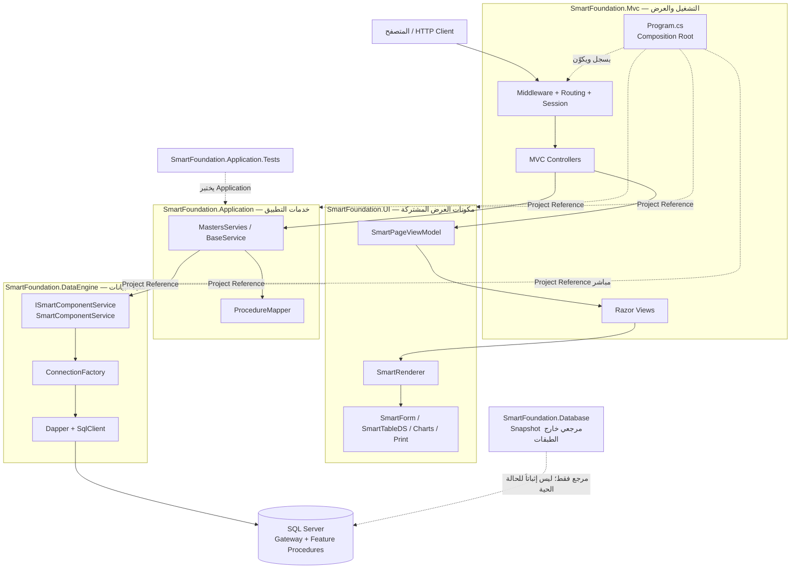

# رسم الطبقات ومراجع المشاريع

درجة الرسم: **مثبت** من ملفات `.csproj` ونقطة التشغيل، مع إظهار SQL Server كوجهة تنفيذ لا كمشروع من الطبقات الأربع.

## قراءة الرسم

- الأسهم المتصلة تمثل مساراً تنفيذياً نموذجياً مثبتاً.
- الأسهم المتقطعة تمثل Project Reference أو علاقة توثيقية.
- وجود Reference مباشر لا يعني بالضرورة استخدامه في كل feature.
