# رسم HTTP Request Pipeline

درجة الرسم: **مثبت** من ترتيب الاستدعاءات في `SmartFoundation.Mvc/Program.cs`.

```mermaid
flowchart LR
    Request["HTTP Request"] --> Compression["1. Response Compression"]
    Compression --> HSTS["2. HSTS"]
    HSTS --> HTTPS["3. HTTPS Redirection"]
    HTTPS --> Cookie["4. Cookie Policy"]
    Cookie --> Headers["5. Security Headers + CSP\ninline middleware"]
    Headers --> Static{"6. Static file?"}
    Static -- "نعم" --> StaticResponse["Static File Response"]
    Static -- "لا" --> Routing["7. Routing"]
    Routing --> Authentication["8. Authentication middleware"]
    Authentication --> Authorization["9. Authorization middleware"]
    Authorization --> Session["10. Session middleware"]
    Session --> Endpoint{"11. Endpoint mapping"}
    Endpoint --> Razor["Razor Pages"]
    Endpoint --> Attribute["Attribute Controllers"]
    Endpoint --> Conventional["Conventional MVC Route\nLogin/Index افتراضياً"]
    Razor --> Response["HTTP Response"]
    Attribute --> Response
    Conventional --> Response
    StaticResponse --> Response
    Response --> OnStarting["OnStarting يضيف headers"]
    OnStarting --> Client["Client"]

    Guard["SessionGuardMiddleware\nموجود كملف لكنه غير مسجل"]
    Guard -. "ليس ضمن pipeline المثبت" .-> Session
```

## حدود الرسم

- وجود مرحلتي Authentication وAuthorization في pipeline مثبت.
- تسجيل scheme/handler أو policies غير مثبت من `Program.cs` أو امتدادات التسجيل النشطة.
- `SessionGuardMiddleware` لا يدخل في المسار الحالي لعدم وجود `UseMiddleware<SessionGuardMiddleware>()`.
