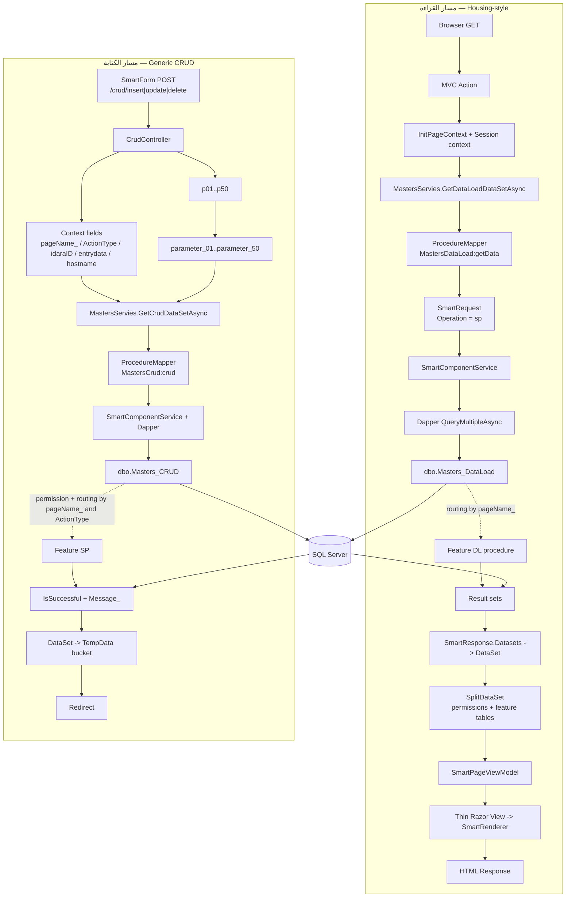

# رسم تدفق القراءة والكتابة

درجة الرسم: المسار حتى بوابات SQL **مثبت** من الكود النشط، وربط صفحات المحادثات 1–7 بإجراءات feature downstream **متحقق من DATACORE الحية** في 07A.

## ثوابت العقد

- أسماء السياق وحالتها جزء من العقد ولا تعاد تسميتها منفردة.
- DataEngine يضيف `@` إلى أسماء Dapper parameters؛ Application code يرسل الأسماء دون `@`.
- ترتيب `pNN` له معنى يحدده `ActionType` وإجراء feature.
