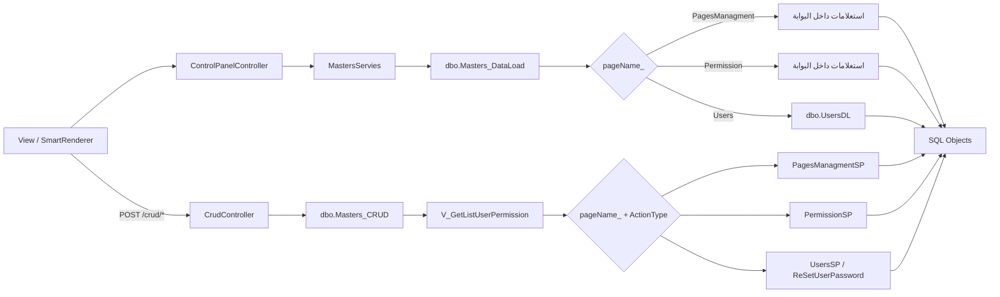
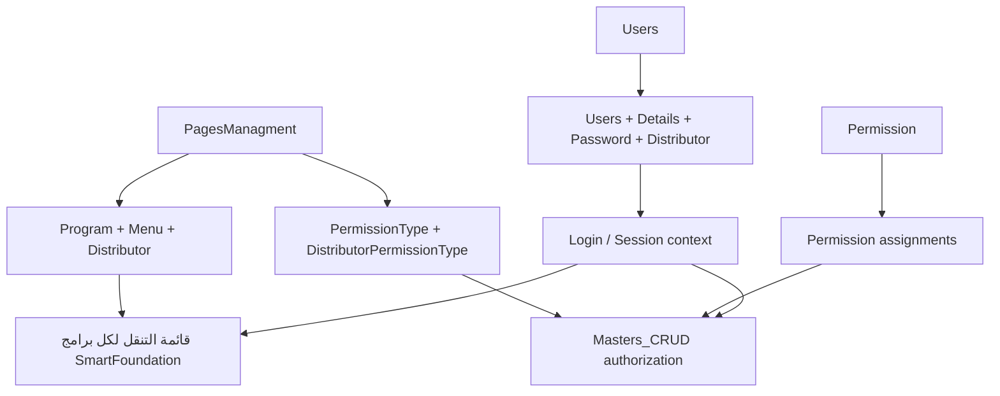
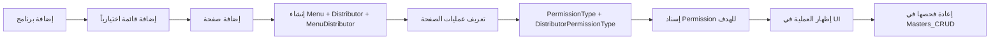

# رسومات تدفق ControlPanel

حالة SQL: routing والكائنات متحققة حياً؛ `UsersDL` الحي يضيف بيانات القسم الحالي.

## تدفق القراءة والكتابة

```mermaid
flowchart LR
    V["View / SmartRenderer"] --> C["ControlPanelController"]
    C --> M["MastersServies"]
    M --> DL["dbo.Masters_DataLoad"]
    DL --> P{"pageName_"}
    P -->|"PagesManagment"| Q1["استعلامات داخل البوابة"]
    P -->|"Permission"| Q2["استعلامات داخل البوابة"]
    P -->|"Users"| UDL["dbo.UsersDL"]
    Q1 --> O["SQL Objects"]
    Q2 --> O
    UDL --> O

    V -->|"POST /crud/*"| CRUD["CrudController"]
    CRUD --> MC["dbo.Masters_CRUD"]
    MC --> CHECK["V_GetListUserPermission"]
    CHECK --> ROUTE{"pageName_ + ActionType"}
    ROUTE --> PMSP["PagesManagmentSP"]
    ROUTE --> PSP["PermissionSP"]
    ROUTE --> USP["UsersSP / ReSetUserPassword"]
    PMSP --> O
    PSP --> O
    USP --> O
```

## اعتماد البرامج على ControlPanel

```mermaid
flowchart TB
    PM["PagesManagment"] --> NAV["Program + Menu + Distributor"]
    PM --> TYPES["PermissionType + DistributorPermissionType"]
    PERM["Permission"] --> GRANTS["Permission assignments"]
    USERS["Users"] --> ACCOUNTS["Users + Details + Password + Distributor"]
    NAV --> MENU["قائمة التنقل لكل برامج SmartFoundation"]
    TYPES --> GATE["Masters_CRUD authorization"]
    GRANTS --> GATE
    ACCOUNTS --> SESSION["Login / Session context"]
    SESSION --> MENU
    SESSION --> GATE
```

## Workflow نشر صفحة

```mermaid
flowchart LR
    A["إضافة برنامج"] --> B["إضافة قائمة اختيارياً"]
    B --> C["إضافة صفحة"]
    C --> D["إنشاء Menu + Distributor + MenuDistributor"]
    D --> E["تعريف عمليات الصفحة"]
    E --> F["PermissionType + DistributorPermissionType"]
    F --> G["إسناد Permission للهدف"]
    G --> H["إظهار العملية في UI"]
    H --> I["إعادة فحصها في Masters_CRUD"]
```
