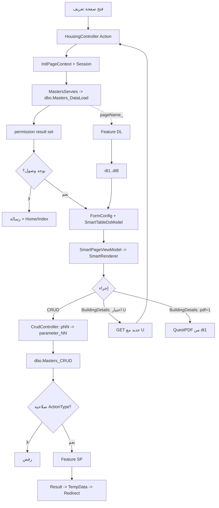
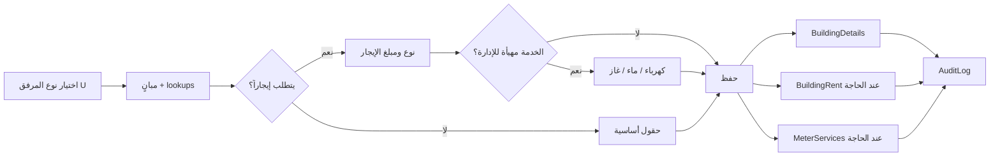

# رسومات تدفق Housing Definitions

المسار حتى SQL gateway **مثبت**؛ routing وإجراءات Definitions العشرة **متحققة حياً ومطابقة للـ Snapshot**.

```mermaid
flowchart TB
    U["فتح صفحة تعريف"] --> C["HousingController Action"]
    C --> S["InitPageContext + Session"]
    S --> DL["MastersServies -> dbo.Masters_DataLoad"]
    DL --> P["permission result set"]
    DL -. "pageName_" .-> FDL["Feature DL"]
    FDL --> RS["dt1..dt8"]
    P --> G{"يوجد وصول؟"}
    G -- "لا" --> H["رسالة + Home/Index"]
    G -- "نعم" --> VM["FormConfig + SmartTableDsModel"]
    RS --> VM
    VM --> V["SmartPageViewModel -> SmartRenderer"]
    V --> A{"إجراء"}
    A -- "CRUD" --> CRUD["CrudController: pNN -> parameter_NN"]
    CRUD --> GW["dbo.Masters_CRUD"]
    GW --> CP{"صلاحية ActionType؟"}
    CP -- "لا" --> DENY["رفض"]
    CP -- "نعم" --> SP["Feature SP"]
    SP --> OUT["Result -> TempData -> Redirect"]
    A -- "BuildingDetails: اختيار U" --> NAV["GET جديد مع U"]
    NAV --> C
    A -- "BuildingDetails: pdf=1" --> PDF["QuestPDF من dt1"]
```

```mermaid
flowchart LR
    Filter["اختيار نوع المرفق U"] --> Load["مبانٍ + lookups"]
    Load --> Rent{"يتطلب إيجاراً؟"}
    Rent -- "نعم" --> RF["نوع ومبلغ الإيجار"]
    Rent -- "لا" --> Basic["حقول أساسية"]
    RF --> Services{"الخدمة مهيأة للإدارة؟"}
    Services -- "نعم" --> SF["كهرباء / ماء / غاز"]
    Services -- "لا" --> Save["حفظ"]
    SF --> Save
    Basic --> Save
    Save --> Detail["BuildingDetails"]
    Save --> RentRow["BuildingRent عند الحاجة"]
    Save --> Links["MeterServices عند الحاجة"]
    Detail --> Audit["AuditLog"]
    RentRow --> Audit
    Links --> Audit
```
