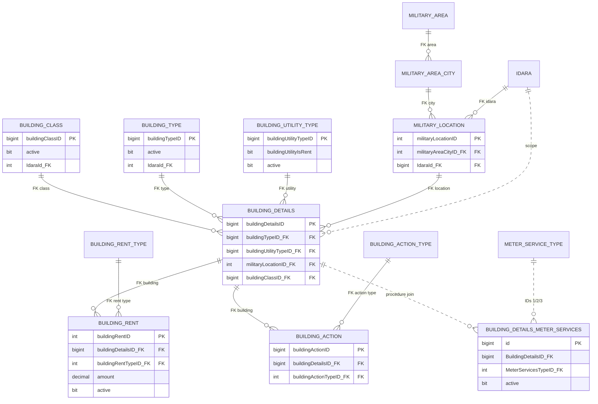

# ERD جزئي لـ Housing Definitions

العلاقات المتصلة FK constraints متحققة من DATACORE الحية في 2026-08-23؛ المنقطة علاقات يستخدمها SQL دون FK حي. Snapshot مرجع مقارنة فقط.

`V_LastActionForBuilding` View وليس كيان تخزين. أكد الكتالوج الحي عدم وجود FK لـ`BuildingDetailsMeterServices`، لذلك بقيت علاقاته منقطة/مستنتجة. الرسم الأشمل: [19-Housing-Live-ERD.md](19-Housing-Live-ERD.md).
