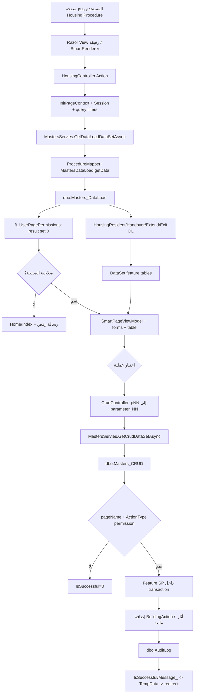

# التدفق الكامل لـ Housing Procedures

المسار حتى البوابات **مثبت**؛ feature routing **متحقق حياً**، مع فروق Resident/Extend/Exit المفصلة في 07A.

ملاحظة: فرع Handover في snapshot يفحص وجود صلاحية للصفحة لكنه لا يقارن `permissionTypeName_E` بـ `ActionType`.
