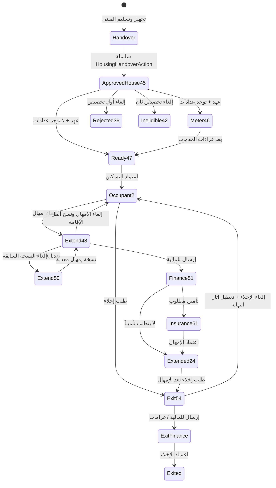

# دورة الإقامة والتسليم والتمديد والإخلاء

الأرقام حالات `BuildingActionTypeID` مثبتة من التعريفات الحية ورسائل الواجهة، وليست قائمة seed كاملة. التسكين إلى 2 يشترط حياً أن يكون بعد آخر خروج.

`buildingActionParentID` و`fn_BuildingAction_ChainToRoot` يحفظان التاريخ ويتيحان العودة لأصل الإقامة دون تعديل الحركة السابقة.
