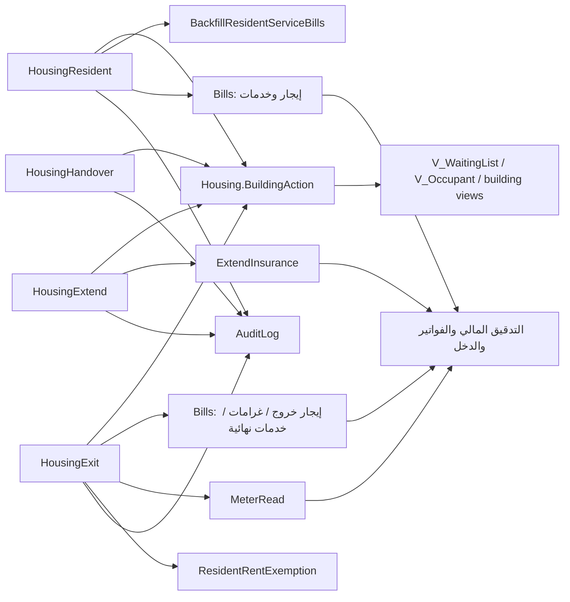

# أثر Housing Procedures على البيانات والبرامج

```mermaid
flowchart LR
    HR["HousingResident"] --> BA["Housing.BuildingAction"]
    HR --> SB["BackfillResidentServiceBills"]
    HR --> RB["Bills: إيجار وخدمات"]
    HH["HousingHandover"] --> BA
    HT["HousingExtend"] --> BA
    HT --> EI["ExtendInsurance"]
    HE["HousingExit"] --> BA
    HE --> B["Bills: إيجار خروج / غرامات / خدمات نهائية"]
    HE --> MR["MeterRead"]
    HE --> RE["ResidentRentExemption"]
    BA --> VW["V_WaitingList / V_Occupant / building views"]
    RB --> FIN["التدقيق المالي والفواتير والدخل"]
    B --> FIN
    EI --> FIN
    MR --> FIN
    HR --> A["AuditLog"]
    HH --> A
    HT --> A
    HE --> A
```

الأسهم إلى “التدقيق المالي والفواتير والدخل” تثبت مشاركة البيانات فقط؛ واجهات البرامج الأخرى خارج نطاق هذه المرحلة.
