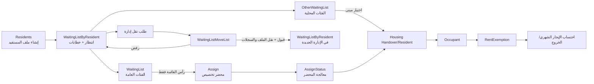

# سير الانتظار والإسناد والنقل والإعفاء

الحركات تحفظ كسلسلة في `BuildingAction`; الإلغاء أو التبديل يضيف حركة جديدة ولا يمحو التاريخ.

التعريف الحي يضم نوع الجذر 25 في `V_WaitingList`. `AssignDL` يعرض حالات المبنى 5 و39 و41، بينما `AssignSP` يقبل أيضاً 42؛ وهذا فرق حي موثق.
