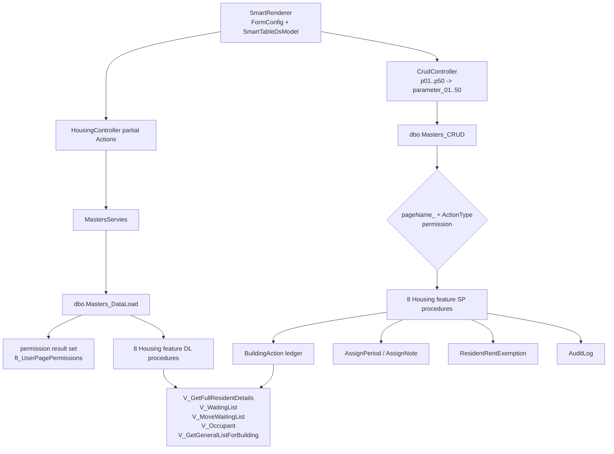

# بوابات وبيانات قوائم الانتظار والإسناد

المسار والـ routing والمعاملات متحققة من `DATACORE` الحية. من 17 feature procedures لهذا النطاق، 15 مطابقة و`AssignDL/SP` مختلفان؛ `BuildingRentForOneMonth` فرق إضافي مرتبط بالإعفاء وخارج هذا العدد.
