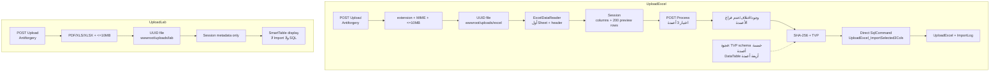

# تدفقات UploadExcel وUploadLab

```mermaid
flowchart TB
    subgraph EX["UploadExcel"]
        E1["POST Upload\nAntiforgery"] --> E2["extension + MIME + <=10MB"]
        E2 --> E3["UUID file\nwwwroot/uploads/excel"]
        E3 --> E4["ExcelDataReader\nأول Sheet + header"]
        E4 --> E5["Session\ncolumns + 200 preview rows"]
        E5 --> E6["POST Process\nاختيار 3 أعمدة"]
        E6 --> E7["وجود/اختلاف/عدم فراغ الأعمدة"]
        E7 --> E8["SHA-256 + TVP"]
        E8 --> E9["Direct SqlCommand\nUploadExcel_ImportSelected3Cols"]
        E9 --> E10["UploadExcel + ImportLog"]
        GAP["فجوة: TVP schema خمسة أعمدة\nDataTable أربعة أعمدة"] -.-> E8
    end
    subgraph LAB["UploadLab"]
        L1["POST Upload\nAntiforgery"] --> L2["PDF/XLS/XLSX + <=10MB"]
        L2 --> L3["UUID file\nwwwroot/uploads/lab"]
        L3 --> L4["Session metadata only"]
        L4 --> L5["SmartTable display\nلا Import ولا SQL"]
    end
```

لم تُنفذ أي خطوة رفع أو معالجة أثناء التوثيق. توقيع الإجراء الحي يؤكد وجود أربعة أسماء أعمدة وTVP، لذلك فجوة shape المرسلة من Controller مثبتة حياً.
