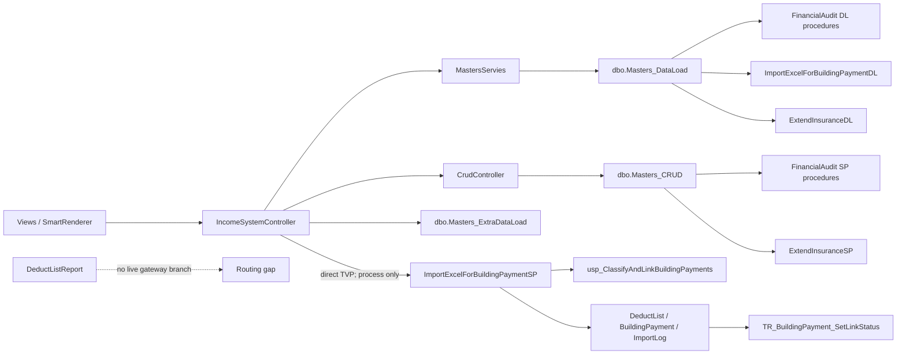

# مسارات IncomeSystem الحية

```mermaid
flowchart LR
    V["Views / SmartRenderer"] --> C["IncomeSystemController"]
    C --> M["MastersServies"]
    M --> DL["dbo.Masters_DataLoad"]
    C --> CRUD["CrudController"]
    CRUD --> MC["dbo.Masters_CRUD"]
    C --> EX["dbo.Masters_ExtraDataLoad"]
    DL --> F1["FinancialAudit DL procedures"]
    DL --> I1["ImportExcelForBuildingPaymentDL"]
    DL --> E1["ExtendInsuranceDL"]
    MC --> F2["FinancialAudit SP procedures"]
    MC --> E2["ExtendInsuranceSP"]
    C -->|"direct TVP; process only"| I2["ImportExcelForBuildingPaymentSP"]
    I2 --> CL["usp_ClassifyAndLinkBuildingPayments"]
    I2 --> BP["DeductList / BuildingPayment / ImportLog"]
    BP --> TR["TR_BuildingPayment_SetLinkStatus"]
    D["DeductListReport"] -. "no live gateway branch" .-> GAP["Routing gap"]
```

الأسهم مثبتة من الكود والتعريفات الحية؛ لم تنفذ الإجراءات.
