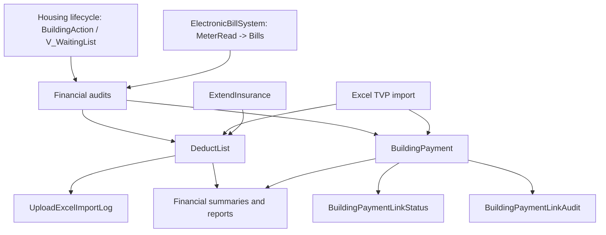

# علاقة البيانات المالية

```mermaid
flowchart TB
    H["Housing lifecycle: BuildingAction / V_WaitingList"] --> A["Financial audits"]
    E["ElectronicBillSystem: MeterRead -> Bills"] --> A
    A --> D["DeductList"]
    A --> P["BuildingPayment"]
    X["Excel TVP import"] --> D
    X --> P
    P --> S["BuildingPaymentLinkStatus"]
    P --> L["BuildingPaymentLinkAudit"]
    D --> U["UploadExcelImportLog"]
    EI["ExtendInsurance"] --> D
    D --> R["Financial summaries and reports"]
    P --> R
```
