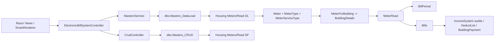

# مسار العداد إلى الفاتورة

درجة الإثبات: المسار حتى gateway مثبت من الكود، وجميع بوابات وإجراءات النطاق بعده مطابقة حياً للـSnapshot.

```mermaid
flowchart LR
    V["Razor Views / SmartRenderer"] --> C["ElectronicBillSystemController"]
    C --> M["MastersServies"]
    M --> DL["dbo.Masters_DataLoad"]
    C --> CRUD["CrudController"]
    CRUD --> MC["dbo.Masters_CRUD"]
    DL --> FDL["Housing Meters/Read DL"]
    MC --> FSP["Housing Meters/Read SP"]
    FDL --> MB["Meter + MeterType + MeterServiceType"]
    MB --> LINK["MeterForBuilding -> BuildingDetails"]
    LINK --> MR["MeterRead"]
    MR --> BP["BillPeriod"]
    MR --> B["Bills"]
    B --> I["IncomeSystem audits / DeductList / BuildingPayment"]
```
