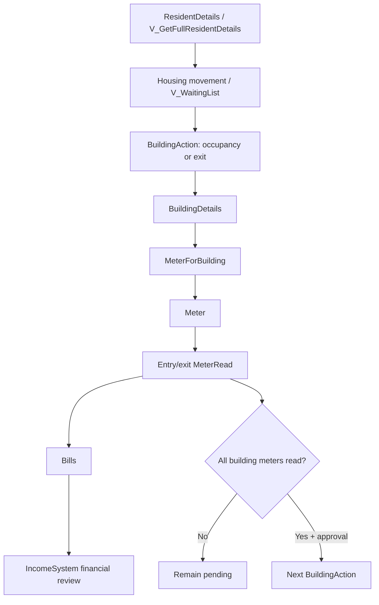

# تكامل قراءات التسكين والإخلاء

درجة الإثبات: UI وحقول الحركة مثبتة من Controller؛ إجراءات وتبعيات SQL المعروضة متحققة من catalog الحي ومطابقة للـSnapshot.

```mermaid
flowchart TB
    R["ResidentDetails / V_GetFullResidentDetails"] --> W["Housing movement / V_WaitingList"]
    W --> A["BuildingAction: occupancy or exit"]
    A --> BD["BuildingDetails"]
    BD --> L["MeterForBuilding"]
    L --> M["Meter"]
    M --> X["Entry/exit MeterRead"]
    X --> B["Bills"]
    X --> OK{"All building meters read?"}
    OK -->|"No"| P["Remain pending"]
    OK -->|"Yes + approval"| N["Next BuildingAction"]
    B --> F["IncomeSystem financial review"]
```
