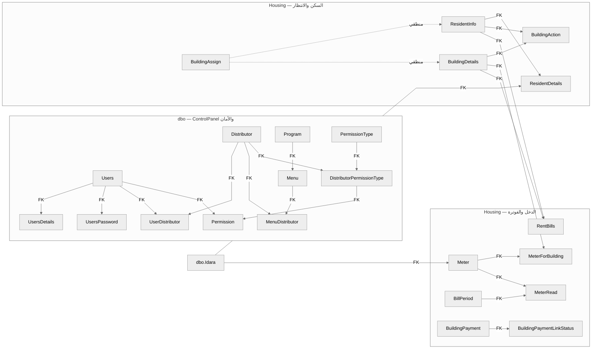

# ERD عام مختصر لقاعدة DATACORE

> إعداد الطباعة: A4 أفقي. يعرض الرسم المجالات والجداول المحورية فقط؛ التفاصيل في الرسومات المستقلة. `FK` قيد حي، و`منطقي` علاقة مستنتجة بلا قيد.

```mermaid
%%{init: {"theme":"neutral","flowchart":{"curve":"linear"}}}%%
flowchart LR
  subgraph CP["dbo — ControlPanel والأمان"]
    U["Users"] -->|"FK"| UD["UsersDetails"]
    U -->|"FK"| UP["UsersPassword"]
    U -->|"FK"| UDist["UserDistributor"]
    Dist["Distributor"] -->|"FK"| UDist
    Prog["Program"] -->|"FK"| Menu["Menu"]
    Menu -->|"FK"| MD["MenuDistributor"]
    Dist -->|"FK"| MD
    Dist -->|"FK"| DPT["DistributorPermissionType"]
    PT["PermissionType"] -->|"FK"| DPT
    DPT -->|"FK"| Perm["Permission"]
    U -->|"FK"| Perm
  end
  subgraph H["Housing — السكن والانتظار"]
    RI["ResidentInfo"] -->|"FK"| RD["ResidentDetails"]
    BD["BuildingDetails"] -->|"FK"| BA["BuildingAction"]
    RI -->|"FK"| BA
    BI["BuildingAssign"] -.->|"منطقي"| RI
    BI -.->|"منطقي"| BD
  end
  subgraph F["Housing — الدخل والفوترة"]
    M["Meter"] -->|"FK"| MFB["MeterForBuilding"]
    BD -->|"FK"| MFB
    M -->|"FK"| MR["MeterRead"]
    BP["BillPeriod"] -->|"FK"| MR
    RI -->|"FK"| RB["RentBills"]
    BD -->|"FK"| RB
    Pay["BuildingPayment"] -->|"FK"| PLS["BuildingPaymentLinkStatus"]
  end
  Idara["dbo.Idara"] -->|"FK"| M
  Idara -->|"FK"| RD
```

