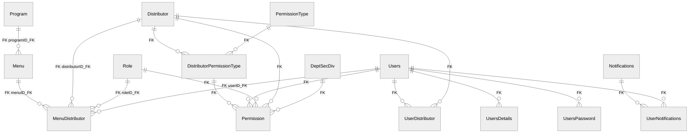

# ERD حي لـControlPanel والصلاحيات

> إعداد الطباعة: A4 أفقي. الخطوط المتصلة FKs حية. الخطوط المتقطعة علاقات مستنتجة وليست قيوداً فعلية.

العلاقات التالية لا تظهر في Mermaid كـFK: `Menu.parentMenuID_FK -> Menu`، و`Permission.IdaraID_FK/InIdaraID -> Idara`، و`DeptSecDiv.OrganizationID_FK/idaraID_FK`؛ كلها علاقات مستنتجة وليست قيوداً فعلية.

