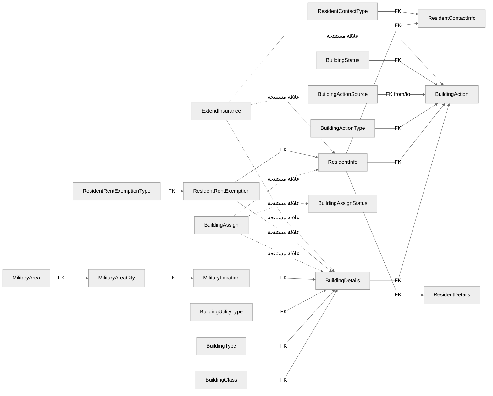

# ERD حي لـHousing

> إعداد الطباعة: A4 أفقي. الرسم مقسم إلى تعريفات، دورة الإقامة، والانتظار. لا يحول الأعمدة المسماة `_FK` إلى قيود ما لم يثبتها الكتالوج.

```mermaid
%%{init: {"theme":"neutral","flowchart":{"curve":"linear"}}}%%
flowchart LR
  BC["BuildingClass"] -->|"FK"| BD["BuildingDetails"]
  BT["BuildingType"] -->|"FK"| BD
  BUT["BuildingUtilityType"] -->|"FK"| BD
  ML["MilitaryLocation"] -->|"FK"| BD
  MAC["MilitaryAreaCity"] -->|"FK"| ML
  MA["MilitaryArea"] -->|"FK"| MAC

  RI["ResidentInfo"] -->|"FK"| RD["ResidentDetails"]
  RI -->|"FK"| RC["ResidentContactInfo"]
  RCT["ResidentContactType"] -->|"FK"| RC
  BD -->|"FK"| BA["BuildingAction"]
  RI -->|"FK"| BA
  BAT["BuildingActionType"] -->|"FK"| BA
  BAS["BuildingActionSource"] -->|"FK from/to"| BA
  BS["BuildingStatus"] -->|"FK"| BA

  Assign["BuildingAssign"] -.->|"علاقة مستنتجة"| RI
  Assign -.->|"علاقة مستنتجة"| BD
  Assign -.->|"علاقة مستنتجة"| AS["BuildingAssignStatus"]
  Ex["ResidentRentExemption"] -->|"FK"| RI
  ExType["ResidentRentExemptionType"] -->|"FK"| Ex
  Ex -.->|"علاقة مستنتجة"| BD
  Ext["ExtendInsurance"] -.->|"علاقة مستنتجة"| BA
  Ext -.->|"علاقة مستنتجة"| RI
  Ext -.->|"علاقة مستنتجة"| BD
```

