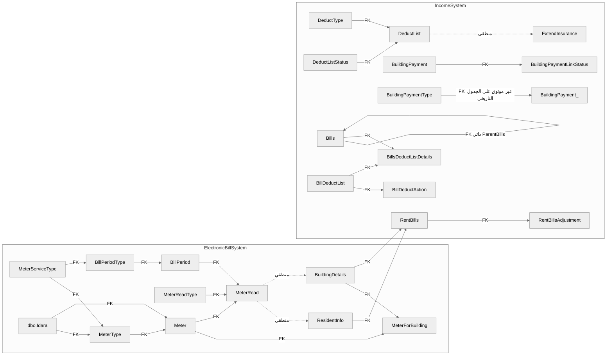

# ERD حي لـIncomeSystem وElectronicBillSystem

> إعداد الطباعة: A4 أفقي. كل الكائنات أدناه تحت Schema `Housing` ما لم يذكر `dbo`. الخط المتقطع علاقة مستنتجة بلا FK حي.

```mermaid
%%{init: {"theme":"neutral","flowchart":{"curve":"linear"}}}%%
flowchart LR
  subgraph Metering["ElectronicBillSystem"]
    MST["MeterServiceType"] -->|"FK"| MT["MeterType"]
    Idara["dbo.Idara"] -->|"FK"| MT
    MT -->|"FK"| M["Meter"]
    Idara -->|"FK"| M
    M -->|"FK"| MFB["MeterForBuilding"]
    BD["BuildingDetails"] -->|"FK"| MFB
    M -->|"FK"| MR["MeterRead"]
    MRT["MeterReadType"] -->|"FK"| MR
    BP["BillPeriod"] -->|"FK"| MR
    BPT["BillPeriodType"] -->|"FK"| BP
    MST -->|"FK"| BPT
    MR -.->|"منطقي"| RI["ResidentInfo"]
    MR -.->|"منطقي"| BD
  end
  subgraph Income["IncomeSystem"]
    RI -->|"FK"| RB["RentBills"]
    BD -->|"FK"| RB
    RB -->|"FK"| RBA["RentBillsAdjustment"]
    BPay["BuildingPayment"] -->|"FK"| BPLS["BuildingPaymentLinkStatus"]
    BPTy["BuildingPaymentType"] -->|"FK غير موثوق على الجدول التاريخي"| BPayOld["BuildingPayment_"]
    DT["DeductType"] -->|"FK"| DL["DeductList"]
    DLS["DeductListStatus"] -->|"FK"| DL
    DL -.->|"منطقي"| Ext["ExtendInsurance"]
    Bills["Bills"] -->|"FK ذاتي ParentBills"| Bills
    BDL["BillDeductList"] -->|"FK"| BDA["BillDeductAction"]
    Bills -->|"FK"| BDD["BillsDeductListDetails"]
    BDL -->|"FK"| BDD
  end
```

