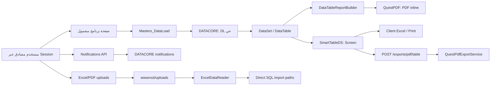

# تدفق التقارير والتكاملات المشتركة

درجة الإثبات: مسارات MVC والمكتبات من الكود؛ أسماء ومعاملات وتبعيات إجراءات التقارير من كتالوج DATACORE الحي. لم ينفذ تقرير أو import أو Business Stored Procedure.

