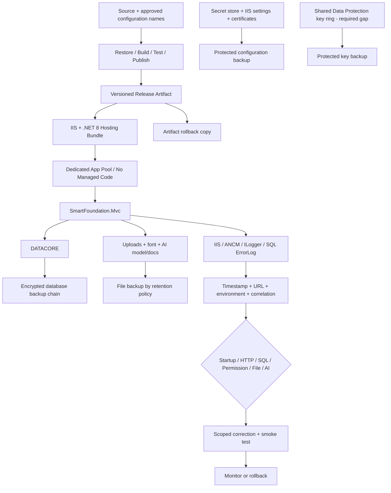

# التشغيل والنشر والنسخ الاحتياطي واستكشاف الأخطاء

```mermaid
flowchart TD
    SRC["Source + approved configuration names"] --> CI["Restore / Build / Test / Publish"]
    CI --> ART["Versioned Release Artifact"]
    ART --> IIS["IIS + .NET 8 Hosting Bundle"]
    IIS --> APP["Dedicated App Pool / No Managed Code"]
    APP --> MVC["SmartFoundation.Mvc"]
    MVC --> DB["DATACORE"]
    MVC --> FILES["Uploads + font + AI model/docs"]
    MVC --> LOGS["IIS / ANCM / ILogger / SQL ErrorLog"]

    DB --> BDB["Encrypted database backup chain"]
    FILES --> BFS["File backup by retention policy"]
    ART --> BAR["Artifact rollback copy"]
    CFG["Secret store + IIS settings + certificates"] --> BCFG["Protected configuration backup"]
    KEYS["Shared Data Protection key ring - required gap"] --> BKEYS["Protected key backup"]

    LOGS --> TRIAGE["Timestamp + URL + environment + correlation"]
    TRIAGE --> CLASSIFY{"Startup / HTTP / SQL / Permission / File / AI"}
    CLASSIFY --> FIX["Scoped correction + smoke test"]
    FIX --> MON["Monitor or rollback"]
```

هذا Runbook توثيقي. لا يثبت أن النشر أو النسخ أو الاستعادة مطبقة، ولم تُنفذ أي منها في مرحلة التوثيق.

