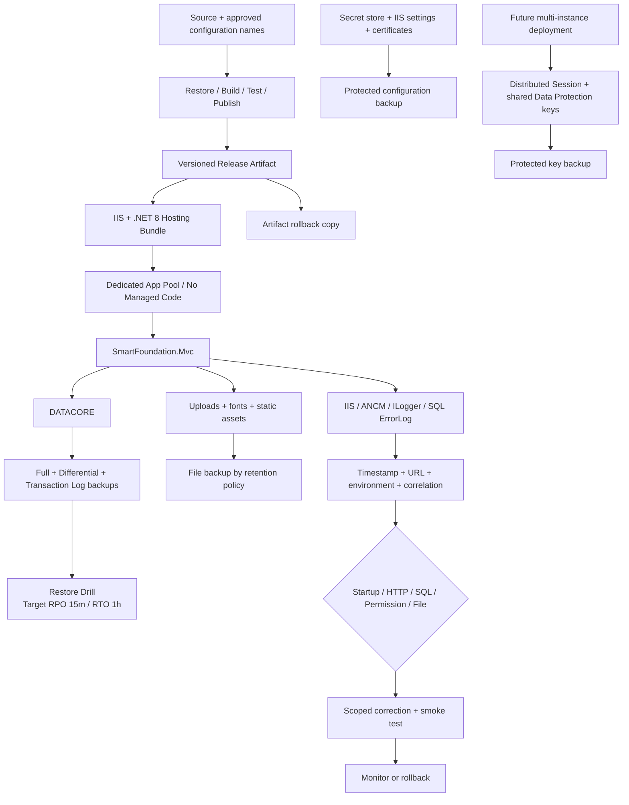

# التشغيل والنشر والنسخ الاحتياطي واستكشاف الأخطاء

هذا Runbook توثيقي. أهداف RPO/RTO مستهدفة وتعتمد على سياسة وجدولة ومراقبة واختبارات بيئة الاستضافة؛ لا يثبت الرسم وحده قبول الإنتاج أو تحقيق الأهداف.

