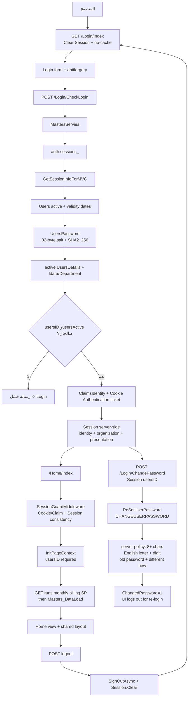

# رسم Authentication وSession

المسار التطبيقي مثبت من الكود، وتعريفات SQL ذات العلاقة قُرئت حياً في 2026-08-23 وطابقت الـSnapshot.

- Cookie Authentication ticket وSession مكونان متكاملان، ويقارن SessionGuard الهوية بينهما.
- ترتيب middleware الحالي: Session ثم Authentication ثم Authorization ثم SessionGuardMiddleware.
- `RESETUSERPASSWORD` الحي ما زال يستخدم كلمة مرور افتراضية ثابتة غير معروضة ويضبط `ChangedPassword=0`.
- الوصف السابق لغياب Claims وSignInAsync وSessionGuard الفعال حالة تاريخية مغلقة ولا يمثل الإصدار 1.0.0.
