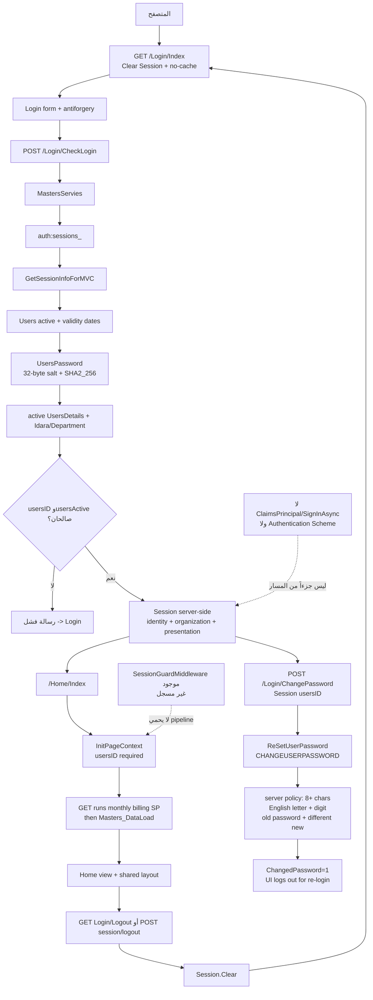

# رسم Authentication وSession

المسار التطبيقي مثبت من الكود، وتعريفات SQL ذات العلاقة قُرئت حياً في 2026-08-23 وطابقت الـSnapshot.

- Session cookie ليست Authentication ticket.
- مسح Session مثبت؛ تدوير Session ID غير مثبت.
- `RESETUSERPASSWORD` الحي ما زال يستخدم كلمة مرور افتراضية ثابتة غير معروضة ويضبط `ChangedPassword=0`.
- تغيير كلمة المرور والخروج/keepalive لا يحملان حماية antiforgery مثبتة.
