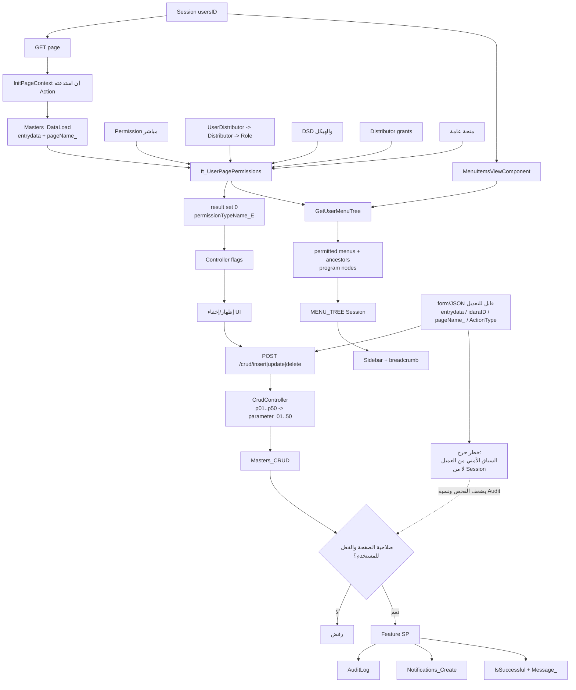

# رسم Authorization وPermissions

MVC والمعاملات مثبتة من الكود؛ `ft_UserPagePermissions` و`GetUserMenuTree` والبوابة ذات العلاقة متحققة حياً ومطابقة للـSnapshot.

- UI gating ليس Authorization boundary.
- لا توجد Claims roles أو `[Authorize(Roles=...)]` في المسار المثبت.
- عقد البرامج تظهر عندما تحتوي شجرتها على قائمة مصرح بها؛ العقد الأب قد تظهر مع `HasPermissionForUser=0` لتكوين المسار.
- `GetUserMenuTree` الكامل يُسجل حالياً في console وInformation log.
