# Tickets Schema — Complete Table Report

> **Source**: `plan-v2.md` sections 11.1–11.29 + 21.1
> **Schema**: `[Tickets]`
> **Total**: 30 tables + 1 SEQUENCE
> **Naming convention**: `IdaraID_FK` on every table, `entryDate` / `entryData` / `hostName` audit columns on every table

---

## Legend

| Abbrev | Meaning |
|---|---|
| **PK** | Primary Key |
| **FK** | Foreign Key |
| **NN** | Not Null |
| **NULL** | Nullable |
| **IDENT** | IDENTITY column |

---

## Category 1: Lookup Tables (12 tables)

### 1. `[Tickets].[RequesterType]`

**Purpose**: Identifies whether the ticket requester is an internal user or a resident.

| # | Column | Type | Null | Key | Default | Description |
|---|---|---|---|---|---|---|
| 1 | `requesterTypeID` | INT | NN | PK, IDENT(1,1) | — | Surrogate primary key |
| 2 | `IdaraID_FK` | BIGINT | NN | FK → `[dbo].[Idara].[idaraID]` | — | Administration scope |
| 3 | `requesterTypeCode` | NVARCHAR(50) | NN | — | — | Short code |
| 4 | `requesterTypeName_A` | NVARCHAR(200) | NN | — | — | Arabic name |
| 5 | `requesterTypeName_E` | NVARCHAR(200) | NN | — | — | English name |
| 6 | `requesterTypeDescription` | NVARCHAR(1000) | NULL | — | — | Optional description |
| 7 | `requesterTypeActive` | BIT | NULL | — | — | Soft delete flag |
| 8 | `entryDate` | DATETIME | NULL | — | — | Record creation timestamp |
| 9 | `entryData` | NVARCHAR(20) | NULL | — | — | Acting user ID (audit) |
| 10 | `hostName` | NVARCHAR(200) | NULL | — | — | Machine name (audit) |

- **Unique**: `(IdaraID_FK, requesterTypeCode)`
- **Seed**: `INTERNAL_USER`, `RESIDENT`

---

### 2. `[Tickets].[TicketClass]`

**Purpose**: Classifies the ticket as incident, service request, or problem (ITIL 4 ticket class).

| # | Column | Type | Null | Key | Default | Description |
|---|---|---|---|---|---|---|
| 1 | `ticketClassID` | INT | NN | PK, IDENT(1,1) | — | Surrogate primary key |
| 2 | `IdaraID_FK` | BIGINT | NN | FK → `[dbo].[Idara]` | — | Administration scope |
| 3 | `ticketClassCode` | NVARCHAR(50) | NN | — | — | Short code |
| 4 | `ticketClassName_A` | NVARCHAR(200) | NN | — | — | Arabic name |
| 5 | `ticketClassName_E` | NVARCHAR(200) | NN | — | — | English name |
| 6 | `ticketClassDescription` | NVARCHAR(1000) | NULL | — | — | Description |
| 7 | `ticketClassActive` | BIT | NULL | — | — | Soft delete flag |
| 8 | `entryDate` | DATETIME | NULL | — | — | Audit |
| 9 | `entryData` | NVARCHAR(20) | NULL | — | — | Audit |
| 10 | `hostName` | NVARCHAR(200) | NULL | — | — | Audit |

- **Unique**: `(IdaraID_FK, ticketClassCode)`
- **Seed**: `INCIDENT`, `SERVICE_REQUEST`, `PROBLEM`

---

### 3. `[Tickets].[TicketStatus]`

**Purpose**: Controls the ticket lifecycle state machine.

| # | Column | Type | Null | Key | Default | Description |
|---|---|---|---|---|---|---|
| 1 | `ticketStatusID` | INT | NN | PK, IDENT(1,1) | — | Surrogate primary key |
| 2 | `IdaraID_FK` | BIGINT | NN | FK → `[dbo].[Idara]` | — | Administration scope |
| 3 | `ticketStatusCode` | NVARCHAR(50) | NN | — | — | Short code |
| 4 | `ticketStatusName_A` | NVARCHAR(200) | NN | — | — | Arabic name |
| 5 | `ticketStatusName_E` | NVARCHAR(200) | NN | — | — | English name |
| 6 | `sortOrder` | INT | NN | — | — | Display/lifecycle order |
| 7 | `isClosedStatus` | BIT | NN | — | — | 1 = terminal/closed state |
| 8 | `isPauseStatus` | BIT | NN | — | — | 1 = SLA pauses in this status |
| 9 | `ticketStatusActive` | BIT | NULL | — | — | Soft delete flag |
| 10 | `entryDate` | DATETIME | NULL | — | — | Audit |
| 11 | `entryData` | NVARCHAR(20) | NULL | — | — | Audit |
| 12 | `hostName` | NVARCHAR(200) | NULL | — | — | Audit |

- **Unique**: `(IdaraID_FK, ticketStatusCode)`
- **Seed**: `NEW`, `TRIAGED`, `ASSIGNED`, `IN_PROGRESS`, `WAITING_ARBITRATION`, `WAITING_CLARIFICATION`, `WAITING_CHILD`, `WAITING_APPROVAL`, `RESOLVED`, `QUALITY_REVIEW`, `CLOSED`, `CANCELLED`, `REJECTED_BY_QUALITY`

---

### 4. `[Tickets].[TicketImpact]`

**Purpose**: ITIL impact level for priority calculation.

| # | Column | Type | Null | Key | Default | Description |
|---|---|---|---|---|---|---|
| 1 | `impactID` | INT | NN | PK, IDENT(1,1) | — | Surrogate primary key |
| 2 | `IdaraID_FK` | BIGINT | NN | FK → `[dbo].[Idara]` | — | Administration scope |
| 3 | `impactCode` | NVARCHAR(50) | NN | — | — | Short code |
| 4 | `impactName_A` | NVARCHAR(200) | NN | — | — | Arabic name |
| 5 | `impactName_E` | NVARCHAR(200) | NN | — | — | English name |
| 6 | `impactScore` | INT | NN | — | — | Numeric weight for matrix |
| 7 | `impactDescription` | NVARCHAR(1000) | NULL | — | — | Description |
| 8 | `impactActive` | BIT | NULL | — | — | Soft delete flag |
| 9–11 | Audit columns | — | — | — | — | entryDate / entryData / hostName |

- **Unique**: `(IdaraID_FK, impactCode)`
- **Seed**: `LOW`, `MEDIUM`, `HIGH`, `CRITICAL`

---

### 5. `[Tickets].[TicketUrgency]`

**Purpose**: ITIL urgency level for priority calculation.

| # | Column | Type | Null | Key | Default | Description |
|---|---|---|---|---|---|---|
| 1 | `urgencyID` | INT | NN | PK, IDENT(1,1) | — | Surrogate primary key |
| 2 | `IdaraID_FK` | BIGINT | NN | FK → `[dbo].[Idara]` | — | Administration scope |
| 3 | `urgencyCode` | NVARCHAR(50) | NN | — | — | Short code |
| 4 | `urgencyName_A` | NVARCHAR(200) | NN | — | — | Arabic name |
| 5 | `urgencyName_E` | NVARCHAR(200) | NN | — | — | English name |
| 6 | `urgencyScore` | INT | NN | — | — | Numeric weight for matrix |
| 7 | `urgencyDescription` | NVARCHAR(1000) | NULL | — | — | Description |
| 8 | `urgencyActive` | BIT | NULL | — | — | Soft delete flag |
| 9–11 | Audit columns | — | — | — | — | entryDate / entryData / hostName |

- **Unique**: `(IdaraID_FK, urgencyCode)`
- **Seed**: `LOW`, `MEDIUM`, `HIGH`, `CRITICAL`

---

### 6. `[Tickets].[TicketPriority]`

**Purpose**: Derived priority from impact × urgency matrix.

| # | Column | Type | Null | Key | Default | Description |
|---|---|---|---|---|---|---|
| 1 | `ticketPriorityID` | INT | NN | PK, IDENT(1,1) | — | Surrogate primary key |
| 2 | `IdaraID_FK` | BIGINT | NN | FK → `[dbo].[Idara]` | — | Administration scope |
| 3 | `ticketPriorityCode` | NVARCHAR(50) | NN | — | — | Short code (P1–P4) |
| 4 | `ticketPriorityName_A` | NVARCHAR(200) | NN | — | — | Arabic name |
| 5 | `ticketPriorityName_E` | NVARCHAR(200) | NN | — | — | English name |
| 6 | `sortOrder` | INT | NN | — | — | Display order |
| 7 | `ticketPriorityColor` | NVARCHAR(30) | NULL | — | — | Hex color for UI badges |
| 8 | `ticketPriorityActive` | BIT | NULL | — | — | Soft delete flag |
| 9–11 | Audit columns | — | — | — | — | entryDate / entryData / hostName |

- **Unique**: `(IdaraID_FK, ticketPriorityCode)`
- **Seed**: `P1`, `P2`, `P3`, `P4`

---

### 7. `[Tickets].[ResolutionType]`

**Purpose**: How the ticket was resolved.

| # | Column | Type | Null | Key | Default | Description |
|---|---|---|---|---|---|---|
| 1 | `resolutionTypeID` | INT | NN | PK, IDENT(1,1) | — | Surrogate primary key |
| 2 | `IdaraID_FK` | BIGINT | NN | FK → `[dbo].[Idara]` | — | Administration scope |
| 3 | `resolutionTypeCode` | NVARCHAR(50) | NN | — | — | Short code |
| 4 | `resolutionTypeName_A` | NVARCHAR(200) | NN | — | — | Arabic name |
| 5 | `resolutionTypeName_E` | NVARCHAR(200) | NN | — | — | English name |
| 6 | `resolutionTypeDescription` | NVARCHAR(1000) | NULL | — | — | Description |
| 7 | `resolutionTypeActive` | BIT | NULL | — | — | Soft delete flag |
| 8–10 | Audit columns | — | — | — | — | entryDate / entryData / hostName |

- **Unique**: `(IdaraID_FK, resolutionTypeCode)`
- **Seed**: `FIXED`, `WORKAROUND`, `KNOWN_ERROR`, `NOT_REPRODUCIBLE`, `DUPLICATE`

---

### 8. `[Tickets].[PauseReason]`

**Purpose**: Why the SLA clock was paused.

| # | Column | Type | Null | Key | Default | Description |
|---|---|---|---|---|---|---|
| 1 | `pauseReasonID` | INT | NN | PK, IDENT(1,1) | — | Surrogate primary key |
| 2 | `IdaraID_FK` | BIGINT | NN | FK → `[dbo].[Idara]` | — | Administration scope |
| 3 | `pauseReasonCode` | NVARCHAR(50) | NN | — | — | Short code |
| 4 | `pauseReasonName_A` | NVARCHAR(200) | NN | — | — | Arabic name |
| 5 | `pauseReasonName_E` | NVARCHAR(200) | NN | — | — | English name |
| 6 | `pausesSLA` | BIT | NN | — | — | 1 = this reason pauses the SLA clock |
| 7 | `pauseReasonDescription` | NVARCHAR(1000) | NULL | — | — | Description |
| 8 | `pauseReasonActive` | BIT | NULL | — | — | Soft delete flag |
| 9–11 | Audit columns | — | — | — | — | entryDate / entryData / hostName |

- **Unique**: `(IdaraID_FK, pauseReasonCode)`
- **Seed**: `ARBITRATION`, `CLARIFICATION`, `WAITING_CHILD`, `WAITING_APPROVAL`, `EXTERNAL_DEPENDENCY`

---

### 9. `[Tickets].[ArbitrationReason]`

**Purpose**: Why a ticket went to arbitration.

| # | Column | Type | Null | Key | Default | Description |
|---|---|---|---|---|---|---|
| 1 | `arbitrationReasonID` | INT | NN | PK, IDENT(1,1) | — | Surrogate primary key |
| 2 | `IdaraID_FK` | BIGINT | NN | FK → `[dbo].[Idara]` | — | Administration scope |
| 3 | `arbitrationReasonCode` | NVARCHAR(50) | NN | — | — | Short code |
| 4 | `arbitrationReasonName_A` | NVARCHAR(200) | NN | — | — | Arabic name |
| 5 | `arbitrationReasonName_E` | NVARCHAR(200) | NN | — | — | English name |
| 6 | `arbitrationReasonDescription` | NVARCHAR(1000) | NULL | — | — | Description |
| 7 | `arbitrationReasonActive` | BIT | NULL | — | — | Soft delete flag |
| 8–10 | Audit columns | — | — | — | — | entryDate / entryData / hostName |

- **Unique**: `(IdaraID_FK, arbitrationReasonCode)`
- **Seed**: `UNKNOWN_SERVICE`, `WRONG_SCOPE`, `CROSS_DEPARTMENT`, `MANAGER_DECISION_REQUIRED`

---

### 10. `[Tickets].[ClarificationReason]`

**Purpose**: Why a clarification was requested.

| # | Column | Type | Null | Key | Default | Description |
|---|---|---|---|---|---|---|
| 1 | `clarificationReasonID` | INT | NN | PK, IDENT(1,1) | — | Surrogate primary key |
| 2 | `IdaraID_FK` | BIGINT | NN | FK → `[dbo].[Idara]` | — | Administration scope |
| 3 | `clarificationReasonCode` | NVARCHAR(50) | NN | — | — | Short code |
| 4 | `clarificationReasonName_A` | NVARCHAR(200) | NN | — | — | Arabic name |
| 5 | `clarificationReasonName_E` | NVARCHAR(200) | NN | — | — | English name |
| 6 | `clarificationReasonDescription` | NVARCHAR(1000) | NULL | — | — | Description |
| 7 | `clarificationReasonActive` | BIT | NULL | — | — | Soft delete flag |
| 8–10 | Audit columns | — | — | — | — | entryDate / entryData / hostName |

- **Unique**: `(IdaraID_FK, clarificationReasonCode)`
- **Seed**: `MISSING_DETAILS`, `MISSING_APPROVAL`, `MISSING_DOCUMENT`, `NEED_PARENT_INPUT`

---

### 11. `[Tickets].[QualityReviewResult]`

**Purpose**: Outcome of the quality review step.

| # | Column | Type | Null | Key | Default | Description |
|---|---|---|---|---|---|---|
| 1 | `qualityReviewResultID` | INT | NN | PK, IDENT(1,1) | — | Surrogate primary key |
| 2 | `IdaraID_FK` | BIGINT | NN | FK → `[dbo].[Idara]` | — | Administration scope |
| 3 | `qualityReviewResultCode` | NVARCHAR(50) | NN | — | — | Short code |
| 4 | `qualityReviewResultName_A` | NVARCHAR(200) | NN | — | — | Arabic name |
| 5 | `qualityReviewResultName_E` | NVARCHAR(200) | NN | — | — | English name |
| 6 | `qualityReviewResultDescription` | NVARCHAR(1000) | NULL | — | — | Description |
| 7 | `qualityReviewResultActive` | BIT | NULL | — | — | Soft delete flag |
| 8–10 | Audit columns | — | — | — | — | entryDate / entryData / hostName |

- **Unique**: `(IdaraID_FK, qualityReviewResultCode)`
- **Seed**: `APPROVED`, `RETURNED`, `REJECTED`

---

### 12. `[Tickets].[OperationalType]` **[V2]**

**Purpose**: Classifies the ticket into one of four operational types that drive workflow behavior.

| # | Column | Type | Null | Key | Default | Description |
|---|---|---|---|---|---|---|
| 1 | `operationalTypeID` | INT | NN | PK, IDENT(1,1) | — | Surrogate primary key |
| 2 | `IdaraID_FK` | BIGINT | NN | FK → `[dbo].[Idara]` | — | Administration scope |
| 3 | `operationalTypeCode` | NVARCHAR(50) | NN | — | — | Short code |
| 4 | `operationalTypeName_A` | NVARCHAR(200) | NN | — | — | Arabic name |
| 5 | `operationalTypeName_E` | NVARCHAR(200) | NN | — | — | English name |
| 6 | `operationalTypeDescription` | NVARCHAR(1000) | NULL | — | — | Description |
| 7 | `operationalTypeActive` | BIT | NULL | — | — | Soft delete flag |
| 8–10 | Audit columns | — | — | — | — | entryDate / entryData / hostName |

- **Unique**: `(IdaraID_FK, operationalTypeCode)`
- **Seed**: `SERVICE_REQUEST`, `DISBURSEMENT`, `EXECUTION`, `INSPECTION`

---

## Category 2: Master Tables (6 tables)

### 13. `[Tickets].[ServiceCategory]`

**Purpose**: Groups services into categories for catalogue management.

| # | Column | Type | Null | Key | Default | Description |
|---|---|---|---|---|---|---|
| 1 | `serviceCategoryID` | BIGINT | NN | PK, IDENT(1,1) | — | Surrogate primary key |
| 2 | `IdaraID_FK` | BIGINT | NN | FK → `[dbo].[Idara]` | — | Administration scope |
| 3 | `serviceCategoryCode` | NVARCHAR(50) | NN | — | — | Short code |
| 4 | `serviceCategoryName_A` | NVARCHAR(200) | NN | — | — | Arabic name |
| 5 | `serviceCategoryName_E` | NVARCHAR(200) | NN | — | — | English name |
| 6 | `serviceCategoryDescription` | NVARCHAR(1000) | NULL | — | — | Description |
| 7 | `sortOrder` | INT | NN | — | — | Display order |
| 8 | `serviceCategoryActive` | BIT | NULL | — | — | Soft delete flag |
| 9–11 | Audit columns | — | — | — | — | entryDate / entryData / hostName |

- **Unique**: `(IdaraID_FK, serviceCategoryCode)`

---

### 14. `[Tickets].[Service]`

**Purpose**: The service catalogue — every service offered with its routing, SLA, and behavior defaults.

| # | Column | Type | Null | Key | Default | Description |
|---|---|---|---|---|---|---|
| 1 | `serviceID` | BIGINT | NN | PK, IDENT(1,1) | — | Surrogate primary key |
| 2 | `IdaraID_FK` | BIGINT | NN | FK → `[dbo].[Idara]` | — | Administration scope |
| 3 | `serviceCategoryID_FK` | BIGINT | NN | FK → `[Tickets].[ServiceCategory]` | — | Parent category |
| 4 | `ticketClassID_FK` | INT | NN | FK → `[Tickets].[TicketClass]` | — | Incident / service request / problem |
| 5 | `operationalTypeID_FK` | INT | NN | FK → `[Tickets].[OperationalType]` | — | **[V2]** Operational type |
| 6 | `defaultImpactID_FK` | INT | NN | FK → `[Tickets].[TicketImpact]` | — | Default impact for this service |
| 7 | `defaultUrgencyID_FK` | INT | NN | FK → `[Tickets].[TicketUrgency]` | — | Default urgency |
| 8 | `defaultPriorityID_FK` | INT | NN | FK → `[Tickets].[TicketPriority]` | — | Default priority |
| 9 | `serviceCode` | NVARCHAR(50) | NN | — | — | Short code |
| 10 | `serviceName_A` | NVARCHAR(200) | NN | — | — | Arabic name |
| 11 | `serviceName_E` | NVARCHAR(200) | NN | — | — | English name |
| 12 | `serviceDescription` | NVARCHAR(MAX) | NULL | — | — | Full description |
| 13 | `allowResidentRequest` | BIT | NN | — | — | 1 = residents can request |
| 14 | `allowInternalRequest` | BIT | NN | — | — | 1 = internal users can request |
| 15 | `requiresQualityReview` | BIT | NN | — | — | 1 = quality review mandatory before close |
| 16 | `allowChildTickets` | BIT | NN | — | — | 1 = can spawn child tickets |
| 17 | `isOtherPlaceholder` | BIT | NN | — | — | 1 = placeholder for "Other" |
| 18 | `serviceActive` | BIT | NULL | — | — | Soft delete flag |
| 19–21 | Audit columns | — | — | — | — | entryDate / entryData / hostName |

- **Unique**: `(IdaraID_FK, serviceCode)`

---

### 15. `[Tickets].[ServiceRoutingRule]`

**Purpose**: Routes a service to the correct DSD (organizational unit) based on requester type.

| # | Column | Type | Null | Key | Default | Description |
|---|---|---|---|---|---|---|
| 1 | `serviceRoutingRuleID` | BIGINT | NN | PK, IDENT(1,1) | — | Surrogate primary key |
| 2 | `IdaraID_FK` | BIGINT | NN | FK → `[dbo].[Idara]` | — | Administration scope |
| 3 | `serviceID_FK` | BIGINT | NN | FK → `[Tickets].[Service]` | — | Service being routed |
| 4 | `requesterTypeID_FK` | INT | NULL | FK → `[Tickets].[RequesterType]` | — | NULL = applies to all requester types |
| 5 | `TargetDSDID_FK` | BIGINT | NN | FK → `[dbo].[DeptSecDiv]` | — | Destination org unit |
| 6 | `TargetDistributorID_FK` | BIGINT | NULL | FK → `[dbo].[Distributor]` | — | Specific role in target unit |
| 7 | `ArbitratorDSDID_FK` | BIGINT | NN | FK → `[dbo].[DeptSecDiv]` | — | Fallback arbitrator org unit |
| 8 | `ArbitratorDistributorID_FK` | BIGINT | NULL | FK → `[dbo].[Distributor]` | — | Specific arbitrator role |
| 9 | `rulePriority` | INT | NN | — | — | Tie-breaker priority |
| 10 | `effectiveFrom` | DATETIME | NN | — | — | Rule start date |
| 11 | `effectiveTo` | DATETIME | NULL | — | — | Rule end date (NULL = active) |
| 12 | `serviceRoutingRuleActive` | BIT | NULL | — | — | Soft delete flag |
| 13–15 | Audit columns | — | — | — | — | entryDate / entryData / hostName |

- **Unique (filtered)**: one active row per `(IdaraID_FK, serviceID_FK, requesterTypeID_FK)` and date window

---

### 16. `[Tickets].[ServiceSLAPolicy]`

**Purpose**: Defines response and resolution time targets per service × priority.

| # | Column | Type | Null | Key | Default | Description |
|---|---|---|---|---|---|---|
| 1 | `serviceSLAPolicyID` | BIGINT | NN | PK, IDENT(1,1) | — | Surrogate primary key |
| 2 | `IdaraID_FK` | BIGINT | NN | FK → `[dbo].[Idara]` | — | Administration scope |
| 3 | `serviceID_FK` | BIGINT | NN | FK → `[Tickets].[Service]` | — | Service |
| 4 | `ticketPriorityID_FK` | INT | NN | FK → `[Tickets].[TicketPriority]` | — | Priority level |
| 5 | `responseTargetMinutes` | INT | NN | — | — | Target time for first response |
| 6 | `resolutionTargetMinutes` | INT | NN | — | — | Target time for resolution |
| 7 | `allowPause` | BIT | NN | — | — | 1 = SLA can be paused for this service |
| 8 | `requiresMajorIncidentReview` | BIT | NN | — | — | 1 = major incident review needed |
| 9 | `effectiveFrom` | DATETIME | NN | — | — | Policy start date |
| 10 | `effectiveTo` | DATETIME | NULL | — | — | Policy end date |
| 11 | `serviceSLAPolicyActive` | BIT | NULL | — | — | Soft delete flag |
| 12–14 | Audit columns | — | — | — | — | entryDate / entryData / hostName |

- **Unique (active)**: `(IdaraID_FK, serviceID_FK, ticketPriorityID_FK)`

---

### 17. `[Tickets].[PriorityMatrix]`

**Purpose**: Maps impact × urgency → priority (ITIL mandatory priority calculation).

| # | Column | Type | Null | Key | Default | Description |
|---|---|---|---|---|---|---|
| 1 | `priorityMatrixID` | BIGINT | NN | PK, IDENT(1,1) | — | Surrogate primary key |
| 2 | `IdaraID_FK` | BIGINT | NN | FK → `[dbo].[Idara]` | — | Administration scope |
| 3 | `impactID_FK` | INT | NN | FK → `[Tickets].[TicketImpact]` | — | Impact level |
| 4 | `urgencyID_FK` | INT | NN | FK → `[Tickets].[TicketUrgency]` | — | Urgency level |
| 5 | `ticketPriorityID_FK` | INT | NN | FK → `[Tickets].[TicketPriority]` | — | Resulting priority |
| 6 | `isMajorIncidentDefault` | BIT | NN | — | — | 1 = this combo defaults to major incident |
| 7 | `priorityMatrixActive` | BIT | NULL | — | — | Soft delete flag |
| 8–10 | Audit columns | — | — | — | — | entryDate / entryData / hostName |

- **Unique**: `(IdaraID_FK, impactID_FK, urgencyID_FK)`

---

### 18. `[Tickets].[ApprovalStep]` **[V2]**

**Purpose**: Template defining the ordered approval chain per operational type and optionally per service.

| # | Column | Type | Null | Key | Default | Description |
|---|---|---|---|---|---|---|
| 1 | `approvalStepID` | BIGINT | NN | PK, IDENT(1,1) | — | Surrogate primary key |
| 2 | `IdaraID_FK` | BIGINT | NN | FK → `[dbo].[Idara]` | — | Administration scope |
| 3 | `operationalTypeID_FK` | INT | NN | FK → `[Tickets].[OperationalType]` | — | Operational type |
| 4 | `serviceID_FK` | BIGINT | NULL | FK → `[Tickets].[Service]` | — | NULL = default for all services under the type |
| 5 | `stepOrder` | INT | NN | — | — | 1-based sequence order |
| 6 | `stepName_A` | NVARCHAR(200) | NN | — | — | Arabic step name |
| 7 | `stepName_E` | NVARCHAR(200) | NN | — | — | English step name |
| 8 | `ApproverDSDID_FK` | BIGINT | NN | FK → `[dbo].[DeptSecDiv]` | — | Org unit that holds the approver |
| 9 | `ApproverDistributorID_FK` | BIGINT | NULL | FK → `[dbo].[Distributor]` | — | Specific role; NULL = any user in DSD |
| 10 | `isRequired` | BIT | NN | — | 1 | 1 = mandatory, 0 = optional/skippable |
| 11 | `isAutoApproved` | BIT | NN | — | 0 | 1 = auto-resolves without human action |
| 12 | `approvalStepActive` | BIT | NULL | — | — | Soft delete flag |
| 13–15 | Audit columns | — | — | — | — | entryDate / entryData / hostName |

- **Unique**: `(IdaraID_FK, operationalTypeID_FK, serviceID_FK, stepOrder)` filtered to active

---

## Category 3: Transaction Tables (8 tables)

### 19. `[Tickets].[Ticket]`

**Purpose**: The central ticket record — the heart of the system.

| # | Column | Type | Null | Key | Default | Description |
|---|---|---|---|---|---|---|
| 1 | `ticketID` | BIGINT | NN | PK, IDENT(1,1) | — | Surrogate primary key |
| 2 | `IdaraID_FK` | BIGINT | NN | FK → `[dbo].[Idara]` | — | Administration scope |
| 3 | `ticketNo` | NVARCHAR(30) | NN | UQ | — | Human-readable ticket number (TKT-YYYY-NNNNNNN) |
| 4 | `ticketClassID_FK` | INT | NN | FK → `[Tickets].[TicketClass]` | — | Incident / service request / problem |
| 5 | `operationalTypeID_FK` | INT | NN | FK → `[Tickets].[OperationalType]` | — | **[V2]** Operational type |
| 6 | `ticketStatusID_FK` | INT | NN | FK → `[Tickets].[TicketStatus]` | — | Current lifecycle status |
| 7 | `requesterTypeID_FK` | INT | NN | FK → `[Tickets].[RequesterType]` | — | Internal user or resident |
| 8 | `serviceID_FK` | BIGINT | NULL | FK → `[Tickets].[Service]` | — | Catalogue service; NULL if "Other" |
| 9 | `UsersID_FK` | BIGINT | NULL | FK → `[dbo].[Users]` | — | Internal requester (XOR with residentInfoID_FK) |
| 10 | `residentInfoID_FK` | BIGINT | NULL | FK → `[Housing].[ResidentInfo]` | — | Resident requester (XOR with UsersID_FK) |
| 11 | `OpenedByUsersID_FK` | BIGINT | NN | FK → `[dbo].[Users]` | — | User who created the ticket |
| 12 | `CurrentDSDID_FK` | BIGINT | NN | FK → `[dbo].[DeptSecDiv]` | — | Current responsible org unit |
| 13 | `CurrentDistributorID_FK` | BIGINT | NULL | FK → `[dbo].[Distributor]` | — | Current role in the unit |
| 14 | `AssignedToUsersID_FK` | BIGINT | NULL | FK → `[dbo].[Users]` | — | Assigned technician |
| 15 | `impactID_FK` | INT | NN | FK → `[Tickets].[TicketImpact]` | — | Impact level |
| 16 | `urgencyID_FK` | INT | NN | FK → `[Tickets].[TicketUrgency]` | — | Urgency level |
| 17 | `ticketPriorityID_FK` | INT | NN | FK → `[Tickets].[TicketPriority]` | — | Priority level |
| 18 | `resolutionTypeID_FK` | INT | NULL | FK → `[Tickets].[ResolutionType]` | — | How resolved; NULL until resolution |
| 19 | `ParentTicketID_FK` | BIGINT | NULL | FK → `[Tickets].[Ticket]` (self) | — | Parent ticket for child relationships |
| 20 | `RootTicketID_FK` | BIGINT | NULL | FK → `[Tickets].[Ticket]` (self) | — | Root of the chain (= self for roots) |
| 21 | `ticketTitle` | NVARCHAR(500) | NN | — | — | Short title |
| 22 | `ticketDescription` | NVARCHAR(MAX) | NN | — | — | Full description |
| 23 | `otherServiceText` | NVARCHAR(500) | NULL | — | — | Free-text when service is "Other" |
| 24 | `resolutionNotes` | NVARCHAR(MAX) | NULL | — | — | Resolution details |
| 25 | `isMajorIncident` | BIT | NN | — | 0 | Flagged as major incident |
| 26 | `openedAt` | DATETIME | NN | — | — | Creation timestamp |
| 27 | `firstRespondedAt` | DATETIME | NULL | — | — | First assignment/response timestamp |
| 28 | `resolvedAt` | DATETIME | NULL | — | — | Resolution timestamp |
| 29 | `closedAt` | DATETIME | NULL | — | — | Final closure timestamp |
| 30 | `lastStatusChangedAt` | DATETIME | NN | — | — | Last status transition timestamp |
| 31 | `ticketActive` | BIT | NULL | — | — | Soft delete flag |
| 32–34 | Audit columns | — | — | — | — | entryDate / entryData / hostName |

- **Unique**: `(IdaraID_FK, ticketNo)`
- **SP Check**: exactly one of `UsersID_FK` or `residentInfoID_FK` must be populated
- **SP Check**: `serviceID_FK` or `otherServiceText` must be populated

---

### 20. `[Tickets].[TicketArbitration]`

**Purpose**: Records each arbitration attempt (including escalations) for a ticket.

| # | Column | Type | Null | Key | Default | Description |
|---|---|---|---|---|---|---|
| 1 | `ticketArbitrationID` | BIGINT | NN | PK, IDENT(1,1) | — | Surrogate primary key |
| 2 | `IdaraID_FK` | BIGINT | NN | FK → `[dbo].[Idara]` | — | Administration scope |
| 3 | `TicketID_FK` | BIGINT | NN | FK → `[Tickets].[Ticket]` | — | Ticket under arbitration |
| 4 | `arbitrationReasonID_FK` | INT | NN | FK → `[Tickets].[ArbitrationReason]` | — | Why arbitration was requested |
| 5 | `RequestedByUsersID_FK` | BIGINT | NN | FK → `[dbo].[Users]` | — | Who requested arbitration |
| 6 | `RequestedFromDSDID_FK` | BIGINT | NN | FK → `[dbo].[DeptSecDiv]` | — | DSD that initiated the dispute |
| 7 | `ArbitratorDSDID_FK` | BIGINT | NN | FK → `[dbo].[DeptSecDiv]` | — | Arbitrator org unit |
| 8 | `DecisionByUsersID_FK` | BIGINT | NULL | FK → `[dbo].[Users]` | — | Who made the decision |
| 9 | `DecisionTargetDSDID_FK` | BIGINT | NULL | FK → `[dbo].[DeptSecDiv]` | — | Redirected target after decision |
| 10 | `decisionNotes` | NVARCHAR(MAX) | NULL | — | — | Arbitrator notes |
| 11 | `requestedAt` | DATETIME | NN | — | — | When arbitration was requested |
| 12 | `decidedAt` | DATETIME | NULL | — | — | When decision was made |
| 13 | `ticketArbitrationActive` | BIT | NULL | — | — | Soft delete flag |
| 14–16 | Audit columns | — | — | — | — | entryDate / entryData / hostName |

- **Constraint**: Only one active arbitration row per ticket at a time

---

### 21. `[Tickets].[TicketClarification]`

**Purpose**: Records clarification requests — from requester or between technicians across units.

| # | Column | Type | Null | Key | Default | Description |
|---|---|---|---|---|---|---|
| 1 | `ticketClarificationID` | BIGINT | NN | PK, IDENT(1,1) | — | Surrogate primary key |
| 2 | `IdaraID_FK` | BIGINT | NN | FK → `[dbo].[Idara]` | — | Administration scope |
| 3 | `TicketID_FK` | BIGINT | NN | FK → `[Tickets].[Ticket]` | — | Ticket needing clarification |
| 4 | `clarificationReasonID_FK` | INT | NN | FK → `[Tickets].[ClarificationReason]` | — | Why clarification is needed |
| 5 | `RequestedByUsersID_FK` | BIGINT | NN | FK → `[dbo].[Users]` | — | Who requested clarification |
| 6 | `RequestedFromUsersID_FK` | BIGINT | NULL | FK → `[dbo].[Users]` | — | Specific user asked (NULL if DSD-wide) |
| 7 | `RequestedFromDSDID_FK` | BIGINT | NULL | FK → `[dbo].[DeptSecDiv]` | — | DSD asked (inter-technician) |
| 8 | `requestText` | NVARCHAR(MAX) | NN | — | — | The clarification question |
| 9 | `responseText` | NVARCHAR(MAX) | NULL | — | — | The clarification answer |
| 10 | `respondedByUsersID_FK` | BIGINT | NULL | FK → `[dbo].[Users]` | — | Who responded |
| 11 | `requestedAt` | DATETIME | NN | — | — | When requested |
| 12 | `respondedAt` | DATETIME | NULL | — | — | When responded |
| 13 | `ticketClarificationActive` | BIT | NULL | — | — | Soft delete flag |
| 14–16 | Audit columns | — | — | — | — | entryDate / entryData / hostName |

- **Constraint**: Only one active clarification per ticket at a time
- **SP Check**: At least one of `RequestedFromUsersID_FK` or `RequestedFromDSDID_FK` must be populated

---

### 22. `[Tickets].[TicketPauseSession]`

**Purpose**: Records each SLA pause/resume window.

| # | Column | Type | Null | Key | Default | Description |
|---|---|---|---|---|---|---|
| 1 | `ticketPauseSessionID` | BIGINT | NN | PK, IDENT(1,1) | — | Surrogate primary key |
| 2 | `IdaraID_FK` | BIGINT | NN | FK → `[dbo].[Idara]` | — | Administration scope |
| 3 | `TicketID_FK` | BIGINT | NN | FK → `[Tickets].[Ticket]` | — | Ticket being paused |
| 4 | `pauseReasonID_FK` | INT | NN | FK → `[Tickets].[PauseReason]` | — | Why SLA was paused |
| 5 | `StartedByUsersID_FK` | BIGINT | NN | FK → `[dbo].[Users]` | — | Who triggered the pause |
| 6 | `EndedByUsersID_FK` | BIGINT | NULL | FK → `[dbo].[Users]` | — | Who ended the pause |
| 7 | `pauseNotes` | NVARCHAR(MAX) | NULL | — | — | Optional notes |
| 8 | `startedAt` | DATETIME | NN | — | — | Pause start timestamp |
| 9 | `endedAt` | DATETIME | NULL | — | — | Pause end timestamp |
| 10 | `pausedMinutes` | INT | NULL | — | — | Calculated duration |
| 11 | `ticketPauseSessionActive` | BIT | NULL | — | — | Soft delete flag |
| 12–14 | Audit columns | — | — | — | — | entryDate / entryData / hostName |

- **Constraint**: Only one active (open-ended) pause session per ticket at a time

---

### 23. `[Tickets].[TicketSLA]`

**Purpose**: The SLA tracking record — one active row per ticket with running clocks and breach flags.

| # | Column | Type | Null | Key | Default | Description |
|---|---|---|---|---|---|---|
| 1 | `ticketSLAID` | BIGINT | NN | PK, IDENT(1,1) | — | Surrogate primary key |
| 2 | `IdaraID_FK` | BIGINT | NN | FK → `[dbo].[Idara]` | — | Administration scope |
| 3 | `TicketID_FK` | BIGINT | NN | FK → `[Tickets].[Ticket]` | — | Ticket |
| 4 | `serviceSLAPolicyID_FK` | BIGINT | NULL | FK → `[Tickets].[ServiceSLAPolicy]` | — | Source policy |
| 5 | `ticketPriorityID_FK` | INT | NN | FK → `[Tickets].[TicketPriority]` | — | Priority used for SLA |
| 6 | `responseTargetMinutes` | INT | NN | — | — | Target minutes for first response |
| 7 | `resolutionTargetMinutes` | INT | NN | — | — | Target minutes for resolution |
| 8 | `responseDueAt` | DATETIME | NN | — | — | Calculated response deadline |
| 9 | `resolutionDueAt` | DATETIME | NN | — | — | Calculated resolution deadline |
| 10 | `totalPausedMinutes` | INT | NN | — | 0 | Accumulated paused time |
| 11 | `responseBreached` | BIT | NN | — | 0 | 1 = response deadline missed |
| 12 | `resolutionBreached` | BIT | NN | — | 0 | 1 = resolution deadline missed |
| 13 | `slaState` | NVARCHAR(50) | NN | — | — | RUNNING / PAUSED / RESOLVED / CLOSED / BREACHED |
| 14 | `ticketSLAActive` | BIT | NULL | — | — | Soft delete flag |
| 15–17 | Audit columns | — | — | — | — | entryDate / entryData / hostName |

- **Constraint**: One active SLA row per ticket

---

### 24. `[Tickets].[TicketQualityReview]`

**Purpose**: Records the quality review step before final closure.

| # | Column | Type | Null | Key | Default | Description |
|---|---|---|---|---|---|---|
| 1 | `ticketQualityReviewID` | BIGINT | NN | PK, IDENT(1,1) | — | Surrogate primary key |
| 2 | `IdaraID_FK` | BIGINT | NN | FK → `[dbo].[Idara]` | — | Administration scope |
| 3 | `TicketID_FK` | BIGINT | NN | FK → `[Tickets].[Ticket]` | — | Ticket under review |
| 4 | `qualityReviewResultID_FK` | INT | NULL | FK → `[Tickets].[QualityReviewResult]` | — | Result: APPROVED / RETURNED / REJECTED |
| 5 | `ReviewerUsersID_FK` | BIGINT | NN | FK → `[dbo].[Users]` | — | Who is reviewing |
| 6 | `reviewNotes` | NVARCHAR(MAX) | NULL | — | — | Reviewer notes |
| 7 | `reviewStartedAt` | DATETIME | NN | — | — | Review start |
| 8 | `reviewCompletedAt` | DATETIME | NULL | — | — | Review completion |
| 9 | `ticketQualityReviewActive` | BIT | NULL | — | — | Soft delete flag |
| 10–12 | Audit columns | — | — | — | — | entryDate / entryData / hostName |

- **Constraint**: Only one active quality review per ticket

---

### 25. `[Tickets].[ServiceCatalogSuggestion]`

**Purpose**: When a requester selects "Other", a suggestion is created for catalogue improvement.

| # | Column | Type | Null | Key | Default | Description |
|---|---|---|---|---|---|---|
| 1 | `serviceCatalogSuggestionID` | BIGINT | NN | PK, IDENT(1,1) | — | Surrogate primary key |
| 2 | `IdaraID_FK` | BIGINT | NN | FK → `[dbo].[Idara]` | — | Administration scope |
| 3 | `TicketID_FK` | BIGINT | NN | FK → `[Tickets].[Ticket]` | — | Source ticket |
| 4 | `requesterTypeID_FK` | INT | NN | FK → `[Tickets].[RequesterType]` | — | Who suggested |
| 5 | `proposedServiceName` | NVARCHAR(200) | NN | — | — | Suggested service name |
| 6 | `proposedCategoryName` | NVARCHAR(200) | NULL | — | — | Suggested category |
| 7 | `proposedTargetDSDID_FK` | BIGINT | NULL | FK → `[dbo].[DeptSecDiv]` | — | Suggested target unit |
| 8 | `reviewedByUsersID_FK` | BIGINT | NULL | FK → `[dbo].[Users]` | — | Who reviewed |
| 9 | `reviewDecision` | NVARCHAR(50) | NULL | — | — | PENDING / ACCEPTED / REJECTED / MERGED |
| 10 | `reviewNotes` | NVARCHAR(MAX) | NULL | — | — | Review notes |
| 11 | `reviewedAt` | DATETIME | NULL | — | — | Review timestamp |
| 12 | `serviceCatalogSuggestionActive` | BIT | NULL | — | — | Soft delete flag |
| 13–15 | Audit columns | — | — | — | — | entryDate / entryData / hostName |

- **Constraint**: One ticket may create zero or one active suggestion

---

### 26. `[Tickets].[TicketApproval]` **[V2]**

**Purpose**: Live approval instances — one row per approval step per ticket.

| # | Column | Type | Null | Key | Default | Description |
|---|---|---|---|---|---|---|
| 1 | `ticketApprovalID` | BIGINT | NN | PK, IDENT(1,1) | — | Surrogate primary key |
| 2 | `IdaraID_FK` | BIGINT | NN | FK → `[dbo].[Idara]` | — | Administration scope |
| 3 | `TicketID_FK` | BIGINT | NN | FK → `[Tickets].[Ticket]` | — | Ticket |
| 4 | `approvalStepID_FK` | BIGINT | NN | FK → `[Tickets].[ApprovalStep]` | — | Template step this instance was created from |
| 5 | `stepOrder` | INT | NN | — | — | Copied from template for ordering |
| 6 | `ApproverUsersID_FK` | BIGINT | NULL | FK → `[dbo].[Users]` | — | Who actually approved/rejected |
| 7 | `approvalStatus` | NVARCHAR(50) | NN | — | — | PENDING / APPROVED / REJECTED / SKIPPED |
| 8 | `approvalNotes` | NVARCHAR(MAX) | NULL | — | — | Approver comments |
| 9 | `requestedAt` | DATETIME | NN | — | — | When this step was activated |
| 10 | `decidedAt` | DATETIME | NULL | — | — | When the decision was made |
| 11 | `ticketApprovalActive` | BIT | NULL | — | — | Soft delete flag |
| 12–14 | Audit columns | — | — | — | — | entryDate / entryData / hostName |

- **Constraint**: Unique `(TicketID_FK, stepOrder)` — one row per step per ticket
- **Constraint**: `SKIPPED` only valid when `ApprovalStep.isRequired = 0`

---

## Category 4: History Tables (4 tables)

### 27. `[Tickets].[TicketHistory]`

**Purpose**: Append-only audit trail for every ticket state change and action.

| # | Column | Type | Null | Key | Default | Description |
|---|---|---|---|---|---|---|
| 1 | `ticketHistoryID` | BIGINT | NN | PK, IDENT(1,1) | — | Surrogate primary key |
| 2 | `IdaraID_FK` | BIGINT | NN | FK → `[dbo].[Idara]` | — | Administration scope |
| 3 | `TicketID_FK` | BIGINT | NN | FK → `[Tickets].[Ticket]` | — | Ticket |
| 4 | `historyActionCode` | NVARCHAR(100) | NN | — | — | What happened (e.g., `STATUS_CHANGE`) |
| 5 | `oldTicketStatusID_FK` | INT | NULL | FK → `[Tickets].[TicketStatus]` | — | Previous status |
| 6 | `newTicketStatusID_FK` | INT | NULL | FK → `[Tickets].[TicketStatus]` | — | New status |
| 7 | `oldDSDID_FK` | BIGINT | NULL | FK → `[dbo].[DeptSecDiv]` | — | Previous org unit |
| 8 | `newDSDID_FK` | BIGINT | NULL | FK → `[dbo].[DeptSecDiv]` | — | New org unit |
| 9 | `oldAssignedToUsersID_FK` | BIGINT | NULL | FK → `[dbo].[Users]` | — | Previous assignee |
| 10 | `newAssignedToUsersID_FK` | BIGINT | NULL | FK → `[dbo].[Users]` | — | New assignee |
| 11 | `performedByUsersID_FK` | BIGINT | NN | FK → `[dbo].[Users]` | — | Who performed the action |
| 12 | `historyNotes` | NVARCHAR(MAX) | NULL | — | — | Optional notes |
| 13 | `performedAt` | DATETIME | NN | — | — | When the action happened |
| 14–16 | Audit columns | — | — | — | — | entryDate / entryData / hostName |

- **Append-only**: no update, no delete

---

### 28. `[Tickets].[TicketSLAHistory]`

**Purpose**: Append-only audit trail for SLA state transitions.

| # | Column | Type | Null | Key | Default | Description |
|---|---|---|---|---|---|---|
| 1 | `ticketSLAHistoryID` | BIGINT | NN | PK, IDENT(1,1) | — | Surrogate primary key |
| 2 | `IdaraID_FK` | BIGINT | NN | FK → `[dbo].[Idara]` | — | Administration scope |
| 3 | `TicketID_FK` | BIGINT | NN | FK → `[Tickets].[Ticket]` | — | Ticket |
| 4 | `TicketSLAID_FK` | BIGINT | NN | FK → `[Tickets].[TicketSLA]` | — | SLA record |
| 5 | `slaActionCode` | NVARCHAR(100) | NN | — | — | What happened (e.g., `PAUSED`, `RESUMED`) |
| 6 | `oldSlaState` | NVARCHAR(50) | NULL | — | — | Previous SLA state |
| 7 | `newSlaState` | NVARCHAR(50) | NULL | — | — | New SLA state |
| 8 | `responseDueAt` | DATETIME | NULL | — | — | Snapshot of response deadline |
| 9 | `resolutionDueAt` | DATETIME | NULL | — | — | Snapshot of resolution deadline |
| 10 | `totalPausedMinutes` | INT | NULL | — | — | Snapshot of accumulated pause |
| 11 | `performedByUsersID_FK` | BIGINT | NN | FK → `[dbo].[Users]` | — | Who triggered the transition |
| 12 | `performedAt` | DATETIME | NN | — | — | When |
| 13 | `historyNotes` | NVARCHAR(MAX) | NULL | — | — | Notes |
| 14–16 | Audit columns | — | — | — | — | entryDate / entryData / hostName |

- **Append-only**: no update, no delete

---

### 29. `[Tickets].[ServiceRoutingRuleHistory]`

**Purpose**: Change-enablement audit trail for routing rule modifications.

| # | Column | Type | Null | Key | Default | Description |
|---|---|---|---|---|---|---|
| 1 | `serviceRoutingRuleHistoryID` | BIGINT | NN | PK, IDENT(1,1) | — | Surrogate primary key |
| 2 | `IdaraID_FK` | BIGINT | NN | FK → `[dbo].[Idara]` | — | Administration scope |
| 3 | `serviceRoutingRuleID_FK` | BIGINT | NN | FK → `[Tickets].[ServiceRoutingRule]` | — | Rule that changed |
| 4 | `serviceID_FK` | BIGINT | NN | FK → `[Tickets].[Service]` | — | Service |
| 5 | `historyActionCode` | NVARCHAR(100) | NN | — | — | INSERT / UPDATE / DELETE |
| 6 | `oldTargetDSDID_FK` | BIGINT | NULL | FK → `[dbo].[DeptSecDiv]` | — | Previous target unit |
| 7 | `newTargetDSDID_FK` | BIGINT | NULL | FK → `[dbo].[DeptSecDiv]` | — | New target unit |
| 8 | `oldArbitratorDSDID_FK` | BIGINT | NULL | FK → `[dbo].[DeptSecDiv]` | — | Previous arbitrator |
| 9 | `newArbitratorDSDID_FK` | BIGINT | NULL | FK → `[dbo].[DeptSecDiv]` | — | New arbitrator |
| 10 | `performedByUsersID_FK` | BIGINT | NN | FK → `[dbo].[Users]` | — | Who changed the rule |
| 11 | `historyNotes` | NVARCHAR(MAX) | NULL | — | — | Notes |
| 12 | `performedAt` | DATETIME | NN | — | — | When |
| 13–15 | Audit columns | — | — | — | — | entryDate / entryData / hostName |

- **Append-only**: no update, no delete

---

### 30. `[Tickets].[ApprovalStepHistory]` **[V2]**

**Purpose**: Audit trail for approval chain template changes (who changed the chain and what they changed).

| # | Column | Type | Null | Key | Default | Description |
|---|---|---|---|---|---|---|
| 1 | `approvalStepHistoryID` | BIGINT | NN | PK, IDENT(1,1) | — | Surrogate primary key |
| 2 | `approvalStepID_FK` | BIGINT | NN | FK → `[Tickets].[ApprovalStep]` | — | Step that changed |
| 3 | `fieldName` | NVARCHAR(100) | NN | — | — | Which field changed |
| 4 | `oldValue` | NVARCHAR(MAX) | NULL | — | — | Previous value |
| 5 | `newValue` | NVARCHAR(MAX) | NULL | — | — | New value |
| 6 | `changedBy` | NVARCHAR(100) | NN | — | — | Who changed it |
| 7 | `changedAt` | DATETIME | NN | — | — | When |
| 8–10 | Audit columns | — | — | — | — | entryDate / entryData / hostName |

- **Append-only**: no update, no delete

---

## Category 5: Sequence Object

### 31. `[Tickets].[TicketNoSeq`

**Type**: SEQUENCE
**Purpose**: Concurrency-safe generation of human-readable ticket numbers.

```sql
CREATE SEQUENCE [Tickets].[TicketNoSeq]
    AS INT
    START WITH 1
    INCREMENT BY 1
    NO CACHE;
```

Used inside `INSERTTICKET`:
```sql
DECLARE @seqVal INT = NEXT VALUE FOR [Tickets].[TicketNoSeq];
SET @ticketNo = FORMAT(@seqVal, 'TKT-' + CAST(YEAR(GETDATE()) AS VARCHAR(4)) + '-{0:0000000}');
```

---

## External Tables Referenced (not in `[Tickets]` schema)

These tables already exist in the database and are referenced via FK but are NOT created by this plan.

| Table | Schema | Purpose |
|---|---|---|
| `[dbo].[Idara]` | dbo | Administration/organization entity |
| `[dbo].[Users]` | dbo | Internal users |
| `[dbo].[DeptSecDiv]` | dbo | Organizational units (Department/Section/Division) |
| `[dbo].[Distributor]` | dbo | Roles within DSDs |
| `[Housing].[ResidentInfo]` | Housing | Resident identity |
| `[dbo].[AuditLog]` | dbo | Central audit log |
| `[dbo].[ErrorLog]` | dbo | Central error log |

---

## ERD — Entity Relationship Diagram

```mermaid
erDiagram
    %% ===== EXTERNAL ENTITIES (referenced, not created) =====
    Idara {
        BIGINT idaraID PK
    }
    Users {
        BIGINT usersID PK
    }
    DeptSecDiv {
        BIGINT DSDID PK
    }
    Distributor {
        BIGINT distributorID PK
    }
    ResidentInfo {
        BIGINT residentInfoID PK
    }

    %% ===== LOOKUP TABLES =====
    RequesterType {
        INT requesterTypeID PK
        BIGINT IdaraID_FK FK
        NVARCHAR requesterTypeCode
    }
    TicketClass {
        INT ticketClassID PK
        BIGINT IdaraID_FK FK
        NVARCHAR ticketClassCode
    }
    TicketStatus {
        INT ticketStatusID PK
        BIGINT IdaraID_FK FK
        NVARCHAR ticketStatusCode
        INT sortOrder
        BIT isClosedStatus
        BIT isPauseStatus
    }
    TicketImpact {
        INT impactID PK
        BIGINT IdaraID_FK FK
        NVARCHAR impactCode
        INT impactScore
    }
    TicketUrgency {
        INT urgencyID PK
        BIGINT IdaraID_FK FK
        NVARCHAR urgencyCode
        INT urgencyScore
    }
    TicketPriority {
        INT ticketPriorityID PK
        BIGINT IdaraID_FK FK
        NVARCHAR ticketPriorityCode
        INT sortOrder
    }
    ResolutionType {
        INT resolutionTypeID PK
        BIGINT IdaraID_FK FK
        NVARCHAR resolutionTypeCode
    }
    PauseReason {
        INT pauseReasonID PK
        BIGINT IdaraID_FK FK
        NVARCHAR pauseReasonCode
        BIT pausesSLA
    }
    ArbitrationReason {
        INT arbitrationReasonID PK
        BIGINT IdaraID_FK FK
        NVARCHAR arbitrationReasonCode
    }
    ClarificationReason {
        INT clarificationReasonID PK
        BIGINT IdaraID_FK FK
        NVARCHAR clarificationReasonCode
    }
    QualityReviewResult {
        INT qualityReviewResultID PK
        BIGINT IdaraID_FK FK
        NVARCHAR qualityReviewResultCode
    }
    OperationalType {
        INT operationalTypeID PK
        BIGINT IdaraID_FK FK
        NVARCHAR operationalTypeCode
    }

    %% ===== MASTER TABLES =====
    ServiceCategory {
        BIGINT serviceCategoryID PK
        BIGINT IdaraID_FK FK
        NVARCHAR serviceCategoryCode
    }
    Service {
        BIGINT serviceID PK
        BIGINT IdaraID_FK FK
        BIGINT serviceCategoryID_FK FK
        INT ticketClassID_FK FK
        INT operationalTypeID_FK FK
        INT defaultImpactID_FK FK
        INT defaultUrgencyID_FK FK
        INT defaultPriorityID_FK FK
        NVARCHAR serviceCode
        BIT allowResidentRequest
        BIT requiresQualityReview
    }
    ServiceRoutingRule {
        BIGINT serviceRoutingRuleID PK
        BIGINT IdaraID_FK FK
        BIGINT serviceID_FK FK
        INT requesterTypeID_FK FK
        BIGINT TargetDSDID_FK FK
        BIGINT ArbitratorDSDID_FK FK
        INT rulePriority
    }
    ServiceSLAPolicy {
        BIGINT serviceSLAPolicyID PK
        BIGINT IdaraID_FK FK
        BIGINT serviceID_FK FK
        INT ticketPriorityID_FK FK
        INT responseTargetMinutes
        INT resolutionTargetMinutes
        BIT allowPause
    }
    PriorityMatrix {
        BIGINT priorityMatrixID PK
        BIGINT IdaraID_FK FK
        INT impactID_FK FK
        INT urgencyID_FK FK
        INT ticketPriorityID_FK FK
    }
    ApprovalStep {
        BIGINT approvalStepID PK
        BIGINT IdaraID_FK FK
        INT operationalTypeID_FK FK
        BIGINT serviceID_FK FK
        INT stepOrder
        BIGINT ApproverDSDID_FK FK
        BIGINT ApproverDistributorID_FK FK
        BIT isRequired
        BIT isAutoApproved
    }

    %% ===== TRANSACTION TABLES =====
    Ticket {
        BIGINT ticketID PK
        BIGINT IdaraID_FK FK
        NVARCHAR ticketNo
        INT ticketClassID_FK FK
        INT operationalTypeID_FK FK
        INT ticketStatusID_FK FK
        INT requesterTypeID_FK FK
        BIGINT serviceID_FK FK
        BIGINT UsersID_FK FK
        BIGINT residentInfoID_FK FK
        BIGINT OpenedByUsersID_FK FK
        BIGINT CurrentDSDID_FK FK
        BIGINT AssignedToUsersID_FK FK
        INT impactID_FK FK
        INT urgencyID_FK FK
        INT ticketPriorityID_FK FK
        INT resolutionTypeID_FK FK
        BIGINT ParentTicketID_FK FK
        BIGINT RootTicketID_FK FK
        NVARCHAR ticketTitle
        BIT isMajorIncident
    }
    TicketArbitration {
        BIGINT ticketArbitrationID PK
        BIGINT IdaraID_FK FK
        BIGINT TicketID_FK FK
        INT arbitrationReasonID_FK FK
        BIGINT ArbitratorDSDID_FK FK
        BIGINT DecisionTargetDSDID_FK FK
        DATETIME requestedAt
        DATETIME decidedAt
    }
    TicketClarification {
        BIGINT ticketClarificationID PK
        BIGINT IdaraID_FK FK
        BIGINT TicketID_FK FK
        INT clarificationReasonID_FK FK
        BIGINT RequestedFromDSDID_FK FK
        NVARCHAR requestText
        NVARCHAR responseText
    }
    TicketPauseSession {
        BIGINT ticketPauseSessionID PK
        BIGINT IdaraID_FK FK
        BIGINT TicketID_FK FK
        INT pauseReasonID_FK FK
        DATETIME startedAt
        DATETIME endedAt
        INT pausedMinutes
    }
    TicketSLA {
        BIGINT ticketSLAID PK
        BIGINT IdaraID_FK FK
        BIGINT TicketID_FK FK
        BIGINT serviceSLAPolicyID_FK FK
        INT ticketPriorityID_FK FK
        DATETIME responseDueAt
        DATETIME resolutionDueAt
        INT totalPausedMinutes
        NVARCHAR slaState
    }
    TicketQualityReview {
        BIGINT ticketQualityReviewID PK
        BIGINT IdaraID_FK FK
        BIGINT TicketID_FK FK
        INT qualityReviewResultID_FK FK
        BIGINT ReviewerUsersID_FK FK
        DATETIME reviewStartedAt
        DATETIME reviewCompletedAt
    }
    ServiceCatalogSuggestion {
        BIGINT serviceCatalogSuggestionID PK
        BIGINT IdaraID_FK FK
        BIGINT TicketID_FK FK
        INT requesterTypeID_FK FK
        NVARCHAR proposedServiceName
        NVARCHAR reviewDecision
    }
    TicketApproval {
        BIGINT ticketApprovalID PK
        BIGINT IdaraID_FK FK
        BIGINT TicketID_FK FK
        BIGINT approvalStepID_FK FK
        INT stepOrder
        NVARCHAR approvalStatus
        DATETIME decidedAt
    }

    %% ===== HISTORY TABLES =====
    TicketHistory {
        BIGINT ticketHistoryID PK
        BIGINT IdaraID_FK FK
        BIGINT TicketID_FK FK
        NVARCHAR historyActionCode
        INT oldTicketStatusID_FK FK
        INT newTicketStatusID_FK FK
    }
    TicketSLAHistory {
        BIGINT ticketSLAHistoryID PK
        BIGINT IdaraID_FK FK
        BIGINT TicketID_FK FK
        BIGINT TicketSLAID_FK FK
        NVARCHAR slaActionCode
        NVARCHAR oldSlaState
        NVARCHAR newSlaState
    }
    ServiceRoutingRuleHistory {
        BIGINT serviceRoutingRuleHistoryID PK
        BIGINT IdaraID_FK FK
        BIGINT serviceRoutingRuleID_FK FK
        BIGINT serviceID_FK FK
        NVARCHAR historyActionCode
    }
    ApprovalStepHistory {
        BIGINT approvalStepHistoryID PK
        BIGINT approvalStepID_FK FK
        NVARCHAR fieldName
        NVARCHAR oldValue
        NVARCHAR newValue
    }

    %% ===== RELATIONSHIPS =====

    %% Ticket → Lookups
    Ticket ||--o{ TicketHistory : "has history"
    Ticket ||--o| TicketSLA : "has SLA"
    Ticket ||--o{ TicketPauseSession : "has pauses"
    Ticket ||--o{ TicketArbitration : "has arbitrations"
    Ticket ||--o{ TicketClarification : "has clarifications"
    Ticket ||--o| TicketQualityReview : "has quality review"
    Ticket ||--o| ServiceCatalogSuggestion : "may suggest"
    Ticket ||--o{ TicketApproval : "has approvals"
    Ticket }o--o| Ticket : "parent of (self-ref)"
    Ticket }o--o| Ticket : "root of (self-ref)"

    Ticket }o--|| TicketClass : "classified as"
    Ticket }o--|| OperationalType : "operates as"
    Ticket }o--|| TicketStatus : "in status"
    Ticket }o--|| RequesterType : "requested by"
    Ticket }o--o| Service : "for service"
    Ticket }o--|| TicketImpact : "impact"
    Ticket }o--|| TicketUrgency : "urgency"
    Ticket }o--|| TicketPriority : "priority"
    Ticket }o--o| ResolutionType : "resolved as"

    Ticket }o--o| Users : "internal requester"
    Ticket }o--o| ResidentInfo : "resident requester"
    Ticket }o--|| Users : "opened by"
    Ticket }o--|| DeptSecDiv : "current DSD"
    Ticket }o--o| Users : "assigned to"

    %% Service hierarchy
    Service }o--|| ServiceCategory : "in category"
    Service }o--|| TicketClass : "default class"
    Service }o--|| OperationalType : "operational type"
    Service ||--o{ ServiceRoutingRule : "has routing rules"
    Service ||--o{ ServiceSLAPolicy : "has SLA policies"
    Service ||--o{ ApprovalStep : "has approval steps"

    %% Routing rule
    ServiceRoutingRule }o--o| RequesterType : "for requester type"
    ServiceRoutingRule }o--|| DeptSecDiv : "target DSD"
    ServiceRoutingRule }o--|| DeptSecDiv : "arbitrator DSD"

    %% SLA
    ServiceSLAPolicy }o--|| TicketPriority : "for priority"

    %% Priority matrix
    PriorityMatrix }o--|| TicketImpact : "impact axis"
    PriorityMatrix }o--|| TicketUrgency : "urgency axis"
    PriorityMatrix }o--|| TicketPriority : "results in"

    %% Approval chain
    ApprovalStep }o--|| OperationalType : "for type"
    ApprovalStep }o--o| Service : "for service"
    ApprovalStep }o--|| DeptSecDiv : "approver DSD"
    TicketApproval }o--|| ApprovalStep : "from template"

    %% Arbitration
    TicketArbitration }o--|| ArbitrationReason : "reason"
    TicketArbitration }o--|| DeptSecDiv : "arbitrator"

    %% Clarification
    TicketClarification }o--|| ClarificationReason : "reason"
    TicketClarification }o--o| DeptSecDiv : "from DSD"

    %% Pause
    TicketPauseSession }o--|| PauseReason : "reason"

    %% Quality review
    TicketQualityReview }o--o| QualityReviewResult : "result"
    TicketQualityReview }o--|| Users : "reviewer"

    %% SLA history
    TicketSLA ||--o{ TicketSLAHistory : "has transitions"

    %% Suggestion
    ServiceCatalogSuggestion }o--|| RequesterType : "from type"

    %% Routing history
    ServiceRoutingRule ||--o{ ServiceRoutingRuleHistory : "has changes"

    %% Approval history
    ApprovalStep ||--o{ ApprovalStepHistory : "has changes"

    %% Idara (every table has it)
    Idara ||--o{ RequesterType : "scopes"
    Idara ||--o{ TicketClass : "scopes"
    Idara ||--o{ TicketStatus : "scopes"
    Idara ||--o{ Ticket : "scopes"
    Idara ||--o{ Service : "scopes"
```



---

## Summary Statistics

| Metric | Value |
|---|---|
| Total tables | 30 |
| Lookup tables (INT PK) | 12 |
| Master tables (BIGINT PK) | 6 |
| Transaction tables (BIGINT PK) | 8 |
| History tables (BIGINT PK, append-only) | 4 |
| SEQUENCE objects | 1 |
| Total FK relationships | ~95 |
| External tables referenced | 7 (`Idara`, `Users`, `DeptSecDiv`, `Distributor`, `ResidentInfo`, `AuditLog`, `ErrorLog`) |
| V2-specific tables | 4 (`OperationalType`, `ApprovalStep`, `TicketApproval`, `ApprovalStepHistory`) |
| Every table has `IdaraID_FK` | Yes |
| Every table has audit columns | Yes (`entryDate`, `entryData`, `hostName`) |
| Soft delete pattern | `*Active BIT NULL` on all non-history tables |
