# Unit Testing for Complete Beginners

## What is Unit Testing? (In Simple Words)

Imagine you're building a car. Would you wait until the entire car is built before checking if the brakes work? **NO!** You test each part separately:

- Does the brake pedal press down? ✅
- Does it send signal to brake pads? ✅
- Do brake pads squeeze the wheel? ✅

**Unit testing is the same idea** - you test each small piece of your code separately to make sure it works BEFORE putting everything together.

---

## Why Should YOU Care About Unit Tests?

### The Horror Story (Without Tests)

```mermaid
flowchart TD
    A[You Write Code] --> B[You Think It Works]
    B --> C[Deploy to Production]
    C --> D[💥 Something Breaks]
    D --> E[Boss Calls You at 3 AM]
    E --> F[Users Are Angry]
    F --> G[You Spend Hours Finding Bug]
    G --> H[Fix Takes 5 Minutes]
    H --> I[You Realize: Could Have Caught This Earlier]
```



### The Happy Story (With Tests)

```mermaid
flowchart TD
    A[You Write Code] --> B[You Write Tests]
    B --> C[Tests Run Automatically]
    C --> D{All Tests Pass?}
    D -->|No| E[Fix Code Now]
    E --> C
    D -->|Yes| F[Deploy with Confidence]
    F --> G[Sleep Peacefully]
    G --> H[Get Promotion 🎉]
```



---

## Why Unit Tests Are Your Best Friend

### 1. **Catch Bugs Early (Save Time)**

**Without Tests:**

- Write code (10 minutes)
- Bug discovered in production (2 weeks later)
- Figure out what broke (2 hours)
- Fix it (10 minutes)
- **Total wasted time: 2+ hours**

**With Tests:**

- Write code (10 minutes)
- Write test (5 minutes)
- Test fails immediately
- Fix it right now (5 minutes)
- **Total time: 20 minutes**

### 2. **Sleep Better at Night**

When you make changes to your code, tests tell you immediately if you broke something:

```mermaid
graph LR
    A[Change Code] --> B[Run Tests]
    B --> C{Tests Pass?}
    C -->|Yes| D[😊 You're Safe!]
    C -->|No| E[⚠️ You Broke Something]
    E --> F[Fix It Now]
    F --> B
```



### 3. **Documentation That Never Lies**

Comments can be wrong. Tests can't lie. If a test passes, the code REALLY works that way.

```csharp
// ❌ Comment might be outdated
// This function adds two numbers

// ✅ Test PROVES what the function does
[Fact]
public void AddNumbers_ReturnsCorrectSum()
{
    var result = Calculator.Add(2, 3);
    Assert.Equal(5, result); // This MUST be true for test to pass
}
```

### 4. **Confidence to Refactor**

Want to make your code better but scared to break it? Tests are your safety net!


---

## How xUnit Works (Super Simple Explanation)

### The Basic Concept

Think of xUnit like a robot teacher that:

1. Reads your test code
2. Runs each test one by one
3. Checks if your code does what you said it should do
4. Gives you a report card (Pass/Fail)

```mermaid
sequenceDiagram
    participant You
    participant xUnit
    participant Your Code
    
    You->>xUnit: Here are my tests
    xUnit->>Your Code: Run this function
    Your Code-->>xUnit: Here's the result
    xUnit->>xUnit: Check if result is correct
    xUnit-->>You: ✅ Test Passed!
```



### The Magic Attributes

xUnit uses special markers (called "attributes") to know what to test:

```csharp
// [Fact] = Hey xUnit! This is a test! Run it!
[Fact]
public void ThisIsATest()
{
    // Your test code here
}
```

**Think of `[Fact]` as a sticky note that says "TEST ME!"**

---

## The Anatomy of a Unit Test (Simple Breakdown)

Every test has 3 parts (remember: **AAA**)


### Example: Testing a Calculator

```csharp
[Fact]
public void Add_TwoNumbers_ReturnsSum()
{
    // ARRANGE (Setup) - Prepare what you need
    var calculator = new Calculator();
    int number1 = 5;
    int number2 = 3;
    
    // ACT (Execute) - Do the thing you want to test
    int result = calculator.Add(number1, number2);
    
    // ASSERT (Check) - Verify it worked correctly
    Assert.Equal(8, result); // Is result equal to 8?
}
```

**In Plain English:**

- **Arrange:** Get a calculator and two numbers (5 and 3)
- **Act:** Add them together
- **Assert:** Check if the answer is 8

If the answer is NOT 8, the test fails and xUnit yells at you! 🚨

---

## How to Test Code That Uses Database (The Tricky Part)

### The Problem

Your code talks to a database through stored procedures:


**But we DON'T want tests to touch the real database because:**

1. It's slow (databases are far away)
2. It might mess up real data
3. Tests should be fast and safe

### The Solution: Mock Objects (Fake It!)

We create a **FAKE** database that pretends to be real:


### What is a Mock?

A **mock** is a puppet that does whatever you tell it to:

```csharp
// Create a fake DataEngine
var fakeDataEngine = new Mock<ISmartComponentService>();

// Tell it what to say when someone calls it
fakeDataEngine
    .Setup(x => x.ExecuteAsync(It.IsAny<SmartRequest>()))
    .ReturnsAsync(new SmartResponse 
    { 
        Success = true, 
        Data = fakeEmployeeData 
    });
```

**In Plain English:**

- "Hey fake DataEngine, when someone calls you..."
- "...pretend you went to the database..."
- "...and return this fake data I'm giving you"

---

## Real Example from Your Project

Let's break down the `EmployeeServiceTests` you have:

```csharp
public class EmployeeServiceTests
{
    // These are our toys (mock objects and service)
    private readonly Mock<ISmartComponentService> _mockDataEngine;
    private readonly Mock<ILogger<EmployeeService>> _mockLogger;
    private readonly EmployeeService _service;

    public EmployeeServiceTests()
    {
        // SETUP: Create fake objects
        _mockDataEngine = new Mock<ISmartComponentService>();
        _mockLogger = new Mock<ILogger<EmployeeService>>();
        
        // Create REAL service but give it FAKE dependencies
        _service = new EmployeeService(
            _mockDataEngine.Object,  // Fake database
            _mockLogger.Object       // Fake logger
        );
    }

    [Fact]
    public async Task GetEmployeeList_ReturnsSuccess_WhenDataEngineSucceeds()
    {
        // ARRANGE (Prepare)
        // Tell fake database what to return
        _mockDataEngine
            .Setup(x => x.ExecuteAsync(It.IsAny<SmartRequest>(), default))
            .ReturnsAsync(new SmartResponse
            {
                Success = true,
                Data = new List<Dictionary<string, object?>>()
            });

        var parameters = new Dictionary<string, object>
        {
            { "pageNumber", 1 },
            { "pageSize", 10 }
        };

        // ACT (Do the thing)
        var result = await _service.GetEmployeeList(parameters);

        // ASSERT (Check the result)
        Assert.NotNull(result);
        var json = JsonDocument.Parse(result);
        Assert.True(json.RootElement.GetProperty("success").GetBoolean());
    }
}
```

### What Happens Step by Step

```mermaid
sequenceDiagram
    participant Test
    participant EmployeeService
    participant FakeDataEngine
    
    Test->>Test: Create fake DataEngine
    Test->>Test: Tell fake what to return
    Test->>EmployeeService: Call GetEmployeeList()
    EmployeeService->>FakeDataEngine: ExecuteAsync()
    FakeDataEngine-->>EmployeeService: Returns fake data
    EmployeeService-->>Test: Returns JSON result
    Test->>Test: Check if JSON has success=true
    Test->>Test: ✅ Test Passes!
```



---

## Understanding Mocking (The Key to Testing with Databases)

### Why We Mock


### Mock Setup Explained

```csharp
// This is like giving instructions to a puppet
_mockDataEngine
    .Setup(x => x.ExecuteAsync(It.IsAny<SmartRequest>(), default))
    .ReturnsAsync(new SmartResponse { Success = true });
```

**Breaking it down:**

1. **`.Setup(x => ...)`** = "When someone calls this method..."
2. **`It.IsAny<SmartRequest>()`** = "...with ANY parameters..."
3. **`.ReturnsAsync(...)`** = "...return this fake response"

### Common Mock Patterns

#### Pattern 1: Always Return Success

```csharp
_mockDataEngine
    .Setup(x => x.ExecuteAsync(It.IsAny<SmartRequest>(), default))
    .ReturnsAsync(new SmartResponse 
    { 
        Success = true,
        Data = fakeData 
    });
```

#### Pattern 2: Always Return Failure

```csharp
_mockDataEngine
    .Setup(x => x.ExecuteAsync(It.IsAny<SmartRequest>(), default))
    .ReturnsAsync(new SmartResponse 
    { 
        Success = false,
        Message = "Database error" 
    });
```

#### Pattern 3: Throw an Exception

```csharp
_mockDataEngine
    .Setup(x => x.ExecuteAsync(It.IsAny<SmartRequest>(), default))
    .ThrowsAsync(new Exception("Database connection failed"));
```

---

## Complete Test Example (With Detailed Comments)

```csharp
[Fact]
public async Task GetEmployeeList_ReturnsError_WhenDatabaseFails()
{
    // ===== ARRANGE (PREPARE) =====
    // Tell the fake database to pretend it failed
    _mockDataEngine
        .Setup(x => x.ExecuteAsync(It.IsAny<SmartRequest>(), default))
        .ReturnsAsync(new SmartResponse
        {
            Success = false,  // Pretend it failed
            Message = "Connection timeout"
        });

    // Create parameters (like a user would send)
    var parameters = new Dictionary<string, object>
    {
        { "pageNumber", 1 },
        { "pageSize", 10 }
    };

    // ===== ACT (DO THE THING) =====
    // Call the real method we want to test
    var result = await _service.GetEmployeeList(parameters);

    // ===== ASSERT (CHECK RESULTS) =====
    // The result should not be null
    Assert.NotNull(result);
    
    // Parse the JSON response
    var json = JsonDocument.Parse(result);
    
    // Check that success is false
    Assert.False(json.RootElement.GetProperty("success").GetBoolean());
    
    // Check that there's an error message
    var message = json.RootElement.GetProperty("message").GetString();
    Assert.NotNull(message);
    Assert.Contains("Connection timeout", message);
}
```

---

## How to Run Tests

### Method 1: Visual Studio

1. Open Test Explorer (Test → Test Explorer)
2. Click "Run All"
3. Watch tests turn green ✅ or red ❌


### Method 2: Command Line

```powershell
# Run all tests
dotnet test

# Run tests in specific project
dotnet test SmartFoundation.Application.Tests/SmartFoundation.Application.Tests.csproj

# Run tests with detailed output
dotnet test --verbosity detailed
```

### Understanding Test Results

```
Starting test execution, please wait...
A total of 1 test files matched the specified pattern.

Passed!  - Failed:     0, Passed:     5, Skipped:     0, Total:     5
```

**Translation:**

- **Passed: 5** = 5 tests worked perfectly ✅
- **Failed: 0** = No broken code 🎉
- **Skipped: 0** = All tests ran

---

## What to Test? (Simple Rules)

### ✅ DO Test

1. **Happy Path** (Everything works)

   ```csharp
   [Fact]
   public void ValidInput_ReturnsSuccess()
   {
       // Test with good data
   }
   ```

2. **Sad Path** (Things go wrong)

   ```csharp
   [Fact]
   public void InvalidInput_ReturnsError()
   {
       // Test with bad data
   }
   ```

3. **Edge Cases** (Weird situations)

   ```csharp
   [Fact]
   public void EmptyList_ReturnsEmptyResult()
   {
       // Test with empty data
   }
   ```

### ❌ DON'T Test

1. **Third-party libraries** (They're already tested)
2. **Database stored procedures** (That's integration testing)
3. **Simple getters/setters** (Too simple to break)

---

## Common Mistakes (And How to Avoid Them)

### Mistake 1: Testing Too Much at Once

```csharp
// ❌ BAD: Testing everything together
[Fact]
public void CompleteUserRegistrationWorkflow()
{
    // This tests 10 different things!
    // If it fails, you don't know which part broke
}

// ✅ GOOD: Test one thing at a time
[Fact]
public void ValidateEmail_WithValidEmail_ReturnsTrue()
{
    // Only tests email validation
}

[Fact]
public void CreateUser_WithValidData_ReturnsSuccess()
{
    // Only tests user creation
}
```

### Mistake 2: Depending on Real Database

```csharp
// ❌ BAD: Talks to real database
[Fact]
public void GetUsers_FromRealDatabase()
{
    var connection = new SqlConnection("Server=...");
    // This is slow and dangerous!
}

// ✅ GOOD: Uses mock
[Fact]
public void GetUsers_FromMockDatabase()
{
    _mockDataEngine.Setup(x => x.ExecuteAsync(...))
    // Fast and safe!
}
```

### Mistake 3: Not Testing Error Cases

```csharp
// ❌ BAD: Only testing success
[Fact]
public void GetEmployee_ReturnsEmployee()
{
    // What if employee doesn't exist?
    // What if database is down?
}

// ✅ GOOD: Test failures too
[Fact]
public void GetEmployee_WhenNotFound_ReturnsError()
{
    // Test the failure case
}

[Fact]
public void GetEmployee_WhenDatabaseDown_ThrowsException()
{
    // Test the exception case
}
```

---

## Your Testing Checklist

For each method in your service, write these tests:

```mermaid
graph TD
    A[Method to Test] --> B[Test 1: Happy Path]
    A --> C[Test 2: Error Path]
    A --> D[Test 3: Null/Empty Input]
    A --> E[Test 4: Exception Handling]
    
    B --> F{All Pass?}
    C --> F
    D --> F
    E --> F
    
    F -->|Yes| G[✅ Method is Safe!]
    F -->|No| H[❌ Fix the Code]
```



**Example for GetEmployeeList:**

- [ ] Test with valid parameters (success)
- [ ] Test with invalid page number
- [ ] Test with database error
- [ ] Test with empty result
- [ ] Test with null parameters
- [ ] Test with exception thrown

---

## Quick Reference: xUnit Assertions

```csharp
// Check if two things are equal
Assert.Equal(expected, actual);

// Check if something is true
Assert.True(condition);

// Check if something is false
Assert.False(condition);

// Check if something is null
Assert.Null(object);

// Check if something is NOT null
Assert.NotNull(object);

// Check if string contains text
Assert.Contains("expected text", actualString);

// Check if exception is thrown
Assert.Throws<Exception>(() => someCode());

// Check if collection is empty
Assert.Empty(collection);

// Check if collection is not empty
Assert.NotEmpty(collection);
```

---

## The Testing Workflow

```mermaid
flowchart TD
    A[Write Service Method] --> B[Write Test for Happy Path]
    B --> C[Run Test]
    C --> D{Test Passes?}
    D -->|No| E[Fix Code]
    E --> C
    D -->|Yes| F[Write Test for Error Case]
    F --> G[Run Test]
    G --> H{Test Passes?}
    H -->|No| I[Add Error Handling]
    I --> G
    H -->|Yes| J[Write More Tests]
    J --> K[All Tests Pass?]
    K -->|Yes| L[✅ Feature Complete!]
    K -->|No| E
    
    style L fill:#90EE90
```



---

## Real-World Benefits (Why Your Boss Cares)


### The Numbers Don't Lie

**Without Tests:**

- Bug found in production: **$5,000** (downtime + fix)
- Time to fix: **4 hours** (finding + fixing + deploying)
- User trust: **-10 points**

**With Tests:**

- Bug caught before production: **$0**
- Time to fix: **10 minutes** (test tells you exactly what's wrong)
- User trust: **No damage**

---

## Summary (TL;DR)

1. **Unit tests are like safety nets** - they catch you when you fall
2. **xUnit is a robot teacher** - it checks your homework automatically
3. **Mock objects are puppets** - they pretend to be real things
4. **AAA is the pattern** - Arrange, Act, Assert
5. **Test both success and failure** - expect things to go wrong
6. **Tests are documentation** - they show how code should work
7. **Fast tests = happy developer** - no waiting for databases

---

## Your First Test Assignment

Try writing this simple test:

```csharp
[Fact]
public async Task GetEmployeeList_WithValidPageNumber_ReturnsSuccess()
{
    // ARRANGE
    // TODO: Setup mock to return success
    // TODO: Create parameters with pageNumber=1, pageSize=10
    
    // ACT
    // TODO: Call _service.GetEmployeeList(parameters)
    
    // ASSERT
    // TODO: Check that result is not null
    // TODO: Check that success = true
}
```

**Start small. Build confidence. Tests will become your best friend!**

---

## Final Motivation


**Remember:** Every senior developer started where you are. The difference? They learned to trust tests, and now they write code fearlessly!

---

**Now go write some tests! Your future self will thank you! 🚀**
