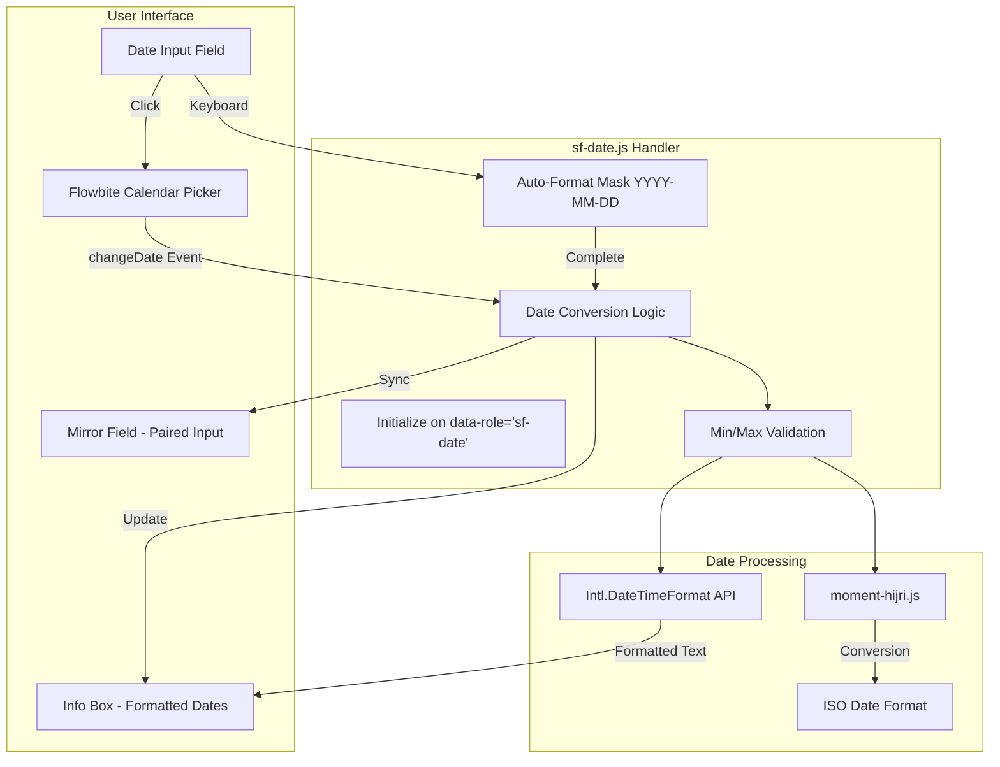

# Dual Date Picker Documentation

## Overview

The Dual Date Picker is a comprehensive date input component for SmartFoundation that seamlessly integrates Gregorian and Hijri (Islamic) calendars. It provides a rich user experience with visual calendar selection, automatic date conversion, and synchronized input fields.

## Features

### Core Capabilities

- ✅ **Visual Calendar Picker**: Flowbite-powered datepicker with intuitive UI
- ✅ **Dual Calendar Support**: Gregorian ↔ Hijri conversion and synchronization
- ✅ **Auto-Formatting**: Smart input masking (YYYY-MM-DD format)
- ✅ **Instant Updates**: Real-time conversion on date selection
- ✅ **Info Boxes**: Formatted date display in both calendars with day names
- ✅ **Mirror Fields**: Automatic sync between paired Gregorian/Hijri inputs
- ✅ **Date Ranges**: Calculate days between start and end dates
- ✅ **Validation**: Min/max date constraints with automatic clamping
- ✅ **RTL Support**: Full right-to-left layout support for Arabic
- ✅ **Alpine.js Integration**: Works seamlessly with dynamic components

### Technical Stack

- **Flowbite Datepicker**: Visual calendar component (wraps vanillajs-datepicker)
- **sf-date.js**: Custom date handler (318 lines)
- **Intl.DateTimeFormat API**: Native browser Hijri calendar support
- **moment-hijri.js**: Extended Hijri date manipulation
- **Alpine.js**: Reactive component framework
- **Tailwind CSS**: Styling framework with RTL support

---

## Architecture

### Component Structure



### Data Flow

1. **Input Click** → Opens Flowbite calendar picker
2. **Date Selection** → Fires `changeDate` event (not native `change`)
3. **Event Handler** → Validates and formats date
4. **Conversion** → Uses Intl.DateTimeFormat for Hijri conversion
5. **Update UI** → Updates info box, mirror field, and range calculations
6. **Sync** → Paired inputs automatically synchronized

---

## Usage Guide

### Basic Date Input

#### Controller Configuration

```csharp
// filepath: Controllers/ExampleController.cs
new FieldConfig
{
    Name = "BirthDate",
    Label = "تاريخ الميلاد",
    Type = "date",
    Calendar = "gregorian",
    MinDateStr = "1950-01-01",
    MaxDateStr = "2025-12-31",
    ShowDayName = true,
    ColCss = "col-span-12 md:col-span-6"
}
```

#### Rendered HTML

```html
<input 
    type="text" 
    id="BirthDate"
    name="BirthDate"
    data-role="sf-date"
    data-calendar="gregorian"
    data-min-date="1950-01-01"
    data-max-date="2025-12-31"
    data-show-day-name="true"
    placeholder="YYYY-MM-DD"
    class="..."
/>
<div id="BirthDate__info">
    <span data-greg-full>—</span>
</div>
```

#### Result

- Visual calendar picker opens on click
- Keyboard input auto-formats to YYYY-MM-DD
- Info box shows: "السبت, 15 يناير, 2000" (with day name)
- Min/max dates enforced

---

### Dual Calendar Mode (Gregorian ↔ Hijri)

#### Controller Configuration

```csharp
// filepath: Controllers/AllComponentsDemoController.cs
new FieldConfig
{
    Name = "BirthDate",
    Label = "تاريخ ميلادي",
    Type = "date",
    Calendar = "both",                    // Enable both calendars
    DateInputCalendar = "gregorian",      // Input in Gregorian
    MirrorName = "BirthDateHijri",        // Synced Hijri field
    MirrorCalendar = "hijri",
    DateDisplayLang = "ar",
    DateNumerals = "latn",
    ShowDayName = true,
    MinDateStr = "1950-01-01",
    MaxDateStr = "2025-12-31",
    ColCss = "col-span-12 md:col-span-3"
}
```

#### Rendered HTML

```html
<!-- Main Gregorian Input -->
<input 
    id="BirthDate"
    data-role="sf-date"
    data-calendar="both"
    data-mirror-name="BirthDateHijri"
    data-mirror-calendar="hijri"
    data-display-lang="ar"
    data-numerals="latn"
    data-show-day-name="true"
    data-min-date="1950-01-01"
    data-max-date="2025-12-31"
    placeholder="YYYY-MM-DD"
/>

<!-- Hidden Mirror Field (Hijri) -->
<input 
    type="hidden" 
    id="BirthDate__mirror" 
    name="BirthDateHijri"
/>

<!-- Info Box -->
<div id="BirthDate__info">
    <div class="info-row">
        <span class="label">الميلادي:</span>
        <span data-greg-full>—</span>
    </div>
    <div class="info-row">
        <span class="label">الهجري:</span>
        <span data-hijri-full>—</span>
    </div>
</div>
```

#### Result

When user selects `2000-01-15`:

- **Main Input**: `2000-01-15`
- **Mirror Field**: `1420-10-08` (auto-calculated)
- **Info Box**:
  - الميلادي: السبت, 15 يناير, 2000
  - الهجري: السبت, 8 شوال, 1420

---

### Date Range with Days Calculator

#### Controller Configuration

```csharp
// Start Date
new FieldConfig
{
    Name = "StartDate",
    Label = "تاريخ البداية",
    Type = "date",
    Calendar = "gregorian",
    RangeGroup = "travel",               // Group name
    RangeRole = "start",                 // Start of range
    DaysTarget = "travel__days",         // Where to show days count
    MinDateStr = "2024-01-01",
    ColCss = "col-span-6"
},

// End Date
new FieldConfig
{
    Name = "EndDate",
    Label = "تاريخ النهاية",
    Type = "date",
    Calendar = "gregorian",
    RangeGroup = "travel",               // Same group
    RangeRole = "end",                   // End of range
    DaysTarget = "travel__days",
    MinDateStr = "2024-01-01",
    ColCss = "col-span-6"
}
```

#### Rendered HTML

```html
<!-- Start Date -->
<input 
    id="StartDate"
    data-role="sf-date"
    data-range-group="travel"
    data-range-role="start"
    data-days-target="travel__days"
/>

<!-- End Date -->
<input 
    id="EndDate"
    data-role="sf-date"
    data-range-group="travel"
    data-range-role="end"
    data-days-target="travel__days"
/>

<!-- Days Counter -->
<div id="travel__days">
    <span data-days-value>—</span> أيام
    <span data-days-error class="hidden"></span>
</div>
```

#### Result

When user selects:

- **Start**: `2024-01-15`
- **End**: `2024-01-25`
- **Days Counter**: `10 أيام`

If end date is before start date:

- **Days Counter**: `— أيام`
- **Error**: `⚠️ التاريخ النهائي قبل الابتدائي`

---

## Configuration Options

### FieldConfig Properties (C#)

All options are configured in controller `FieldConfig` objects:

| Property | Type | Default | Description |
|----------|------|---------|-------------|
| `Type` | `string` | - | Must be `"date"` to enable date picker |
| `Calendar` | `string` | `"gregorian"` | `"gregorian"`, `"hijri"`, or `"both"` |
| `DateInputCalendar` | `string` | `"gregorian"` | Which calendar the input field uses |
| `MirrorName` | `string` | `null` | Name of paired input field for sync |
| `MirrorCalendar` | `string` | `"hijri"` | Calendar system for mirror field |
| `DateDisplayLang` | `string` | `"ar"` | Display language (`"ar"` or `"en"`) |
| `DateNumerals` | `string` | `"latn"` | Numeral system (`"latn"` or `"arab"`) |
| `ShowDayName` | `bool` | `true` | Show weekday name in info box |
| `DefaultToday` | `bool` | `false` | Auto-select today's date on load |
| `MinDateStr` | `string` | `null` | Minimum selectable date (ISO format) |
| `MaxDateStr` | `string` | `null` | Maximum selectable date (ISO format) |
| `DisplayFormat` | `string` | `"yyyy-mm-dd"` | Input display format |
| `RangeGroup` | `string` | `null` | Group name for date range pairs |
| `RangeRole` | `string` | `null` | `"start"` or `"end"` for ranges |
| `DaysTarget` | `string` | `null` | ID of element to show days count |

### Data Attributes (HTML)

These are automatically generated from `FieldConfig`:

```html
<input 
    data-role="sf-date"                      <!-- Required: Activates handler -->
    data-calendar="gregorian|hijri|both"     <!-- Calendar mode -->
    data-date-format="yyyy-mm-dd"            <!-- Input format -->
    data-mirror-name="FieldName"             <!-- Paired field -->
    data-mirror-calendar="hijri|gregorian"   <!-- Mirror calendar -->
    data-display-lang="ar|en"                <!-- Display language -->
    data-numerals="latn|arab"                <!-- Numeral system -->
    data-show-day-name="true|false"          <!-- Show weekday -->
    data-default-today="true|false"          <!-- Auto-select today -->
    data-min-date="YYYY-MM-DD"               <!-- Min constraint -->
    data-max-date="YYYY-MM-DD"               <!-- Max constraint -->
    data-range-group="groupName"             <!-- Range group -->
    data-range-role="start|end"              <!-- Range position -->
    data-days-target="elementId"             <!-- Days counter -->
/>
```

---

## Flowbite Datepicker Integration

### Initialization

The `sf-date.js` handler automatically initializes Flowbite Datepicker:

```javascript
// filepath: wwwroot/js/sf-date.js (lines 270-301)
if (typeof Datepicker !== 'undefined') {
    const dpOptions = {
        format: 'yyyy-mm-dd',
        autohide: true,
        orientation: 'bottom',
        buttons: false,
        autoSelectToday: 0,
        todayHighlight: false
    };
    
    if (cfg.minDate) dpOptions.minDate = cfg.minDate;
    if (cfg.maxDate) dpOptions.maxDate = cfg.maxDate;
    
    try {
        const datepickerInstance = new Datepicker(input, dpOptions);
        input._flowbiteDatepicker = datepickerInstance;
        
        // Listen for date selection
        input.addEventListener('changeDate', (e) => {
            if (input.value && isISO(input.value)) {
                commitIfComplete(input, cfg, { blur: false, focusPartner: false });
            }
        });
    } catch (error) {
        console.warn('Failed to initialize Flowbite datepicker:', error);
    }
}
```

### Key Points

1. **Event Type**: Uses `changeDate` custom event (not native `change`)
   - `changeDate`: Fires immediately when date selected from calendar
   - `change`: Only fires on blur (wrong for instant updates)

2. **Options**:
   - `format: 'yyyy-mm-dd'`: ISO date format
   - `autohide: true`: Close calendar after selection
   - `orientation: 'bottom'`: Calendar appears below input
   - `buttons: false`: No "Today" or "Clear" buttons
   - `minDate/maxDate`: Constraints from FieldConfig

3. **Instance Storage**: `input._flowbiteDatepicker` for programmatic access

---

## Hijri Calendar Conversion

### Using Intl.DateTimeFormat API

The component uses browser-native Hijri conversion:

```javascript
// filepath: wwwroot/js/sf-date.js (lines 34-48)
function fullText(date, { calendar = "gregory", lang = "ar", numerals = "latn", showDay = true } = {}) {
    if (!(date instanceof Date) || Number.isNaN(+date)) return "—";
    
    const opts = {
        calendar,
        weekday: showDay ? "long" : undefined,
        year: "numeric", 
        month: "long", 
        day: "numeric",
        numberingSystem: numerals === "arab" ? "arab" : "latn",
    };
    
    try { 
        return new Intl.DateTimeFormat(`${lang}-u-ca-${calendar}`, opts).format(date); 
    } catch { 
        return toISO(date); 
    }
}
```

### Hijri ISO Format

```javascript
// filepath: wwwroot/js/sf-date.js (lines 49-58)
function hijriISO(date) {
    try {
        const p = new Intl.DateTimeFormat("ar-SA-u-ca-islamic", { 
            year: "numeric", 
            month: "2-digit", 
            day: "2-digit", 
            numberingSystem: "latn" 
        }).formatToParts(date);
        
        const y = p.find(x => x.type === "year")?.value;
        const m = p.find(x => x.type === "month")?.value;
        const d = p.find(x => x.type === "day")?.value;
        
        return (y && m && d) ? `${y}-${m}-${d}` : "";
    } catch { 
        return ""; 
    }
}
```

### Example Conversions

| Gregorian | Hijri | Formatted (Arabic) |
|-----------|-------|--------------------|
| 2000-01-15 | 1420-10-08 | السبت, 8 شوال, 1420 |
| 2024-12-25 | 1446-06-23 | الأربعاء, 23 جمادى الآخرة, 1446 |
| 1990-06-30 | 1410-12-07 | السبت, 7 ذو الحجة, 1410 |

---

## Alpine.js Integration

### Lifecycle Timing

The `sf-date.js` handler integrates with Alpine.js lifecycle:

```javascript
// filepath: wwwroot/js/sf-date.js (lines 310-313)
// Initialize on DOMContentLoaded (for non-Alpine pages)
if (document.readyState === "loading") 
    document.addEventListener("DOMContentLoaded", boot);
else 
    boot();

// Initialize after Alpine.js completes (for Alpine-based pages)
document.addEventListener("alpine:initialized", boot);
```

### Why This Matters

- **AllComponentsDemo** uses Alpine.js to render SmartForm components
- Without `alpine:initialized`, sf-date.js runs before inputs exist
- Dual initialization ensures compatibility with both static and dynamic pages

### Double-Initialization Guard

```javascript
// filepath: wwwroot/js/sf-date.js (lines 201-203)
// Guard: prevent double initialization
if (input.dataset.sfDateInitialized === "true") return;
input.dataset.sfDateInitialized = "true";
```

Prevents duplicate datepicker instances when both events fire.

---

## Styling & RTL Support

### Tailwind CSS Classes

Date inputs use Tailwind for styling:

```html
<input 
    class="bg-gray-50 border border-gray-300 text-gray-900 text-sm 
           rounded-lg focus:ring-blue-500 focus:border-blue-500 
           block w-full p-2.5 
           dark:bg-gray-700 dark:border-gray-600 dark:text-white"
/>
```

### RTL Layout

Full right-to-left support for Arabic:

```html
<div class="relative" dir="rtl">
    <input type="text" class="..." />
    <div class="absolute inset-y-0 start-0">
        <svg><!-- Calendar icon --></svg>
    </div>
</div>
```

### Info Box Styling

```html
<div id="BirthDate__info" class="mt-2 text-sm">
    <div class="flex justify-between py-1 border-b">
        <span class="font-semibold text-gray-600">الميلادي:</span>
        <span data-greg-full class="text-gray-900">—</span>
    </div>
    <div class="flex justify-between py-1">
        <span class="font-semibold text-gray-600">الهجري:</span>
        <span data-hijri-full class="text-gray-900">—</span>
    </div>
</div>
```

---

## Advanced Features

### Auto-Formatting Mask

Keyboard input is automatically formatted to YYYY-MM-DD:

```javascript
// User types: 20000115
// Auto-formats to: 2000-01-15

function applyMaskKeepCaret(input) {
    const sel = input.selectionStart || 0;
    const preDigits = countDigits(input.value.slice(0, sel));
    const d = digitsOnly(input.value).slice(0, 8);
    const masked = maskedFromDigits(d);
    input.value = masked;
    const newCaret = indexAfterNthDigit(masked, preDigits);
    input.setSelectionRange(newCaret, newCaret);
    return masked;
}
```

Features:

- Preserves caret position during formatting
- Accepts Arabic numerals (٠-٩), converts to Latin
- Strips non-numeric characters
- Adds hyphens automatically

### Date Validation & Clamping

Dates are automatically constrained to min/max:

```javascript
function clampDate(dt, min, max) {
    let t = +dt;
    if (min instanceof Date && !Number.isNaN(+min)) 
        t = Math.max(t, +min);
    if (max instanceof Date && !Number.isNaN(+max)) 
        t = Math.min(t, +max);
    return new Date(t);
}
```

Example:

- Min: `1950-01-01`, Max: `2025-12-31`
- User enters: `1940-05-15` → Auto-corrected to `1950-01-01`
- User enters: `2030-08-20` → Auto-corrected to `2025-12-31`

### Range Validation

Date ranges are validated in real-time:

```javascript
function updateDays(cfg) {
    const from = qs(`input[data-range-group="${cfg.group}"][data-range-role="start"]`);
    const to = qs(`input[data-range-group="${cfg.group}"][data-range-role="end"]`);
    
    const d1 = fromISO(from?.value || "");
    const d2 = fromISO(to?.value || "");
    
    if (d1 && d2) {
        const diff = Math.floor((+d2 - +d1) / MS_DAY);
        if (diff >= 0) {
            // Valid range: show days
            daysValueEl.textContent = String(diff);
        } else {
            // Invalid: end before start
            daysErrorEl.textContent = "⚠️ التاريخ النهائي قبل الابتدائي";
            daysErrorEl.classList.remove("hidden");
        }
    }
}
```

---

## Troubleshooting

### Calendar Not Appearing

**Symptom**: Clicking input doesn't show calendar

**Causes**:

1. Flowbite Datepicker not loaded
2. jQuery missing (Flowbite dependency)
3. JavaScript errors blocking initialization

**Solution**:

```html
<!-- Check these are loaded in _Layout.cshtml -->
<script src="https://code.jquery.com/jquery-3.7.1.min.js"></script>
<script src="https://cdn.jsdelivr.net/npm/flowbite@2.5.2/dist/flowbite.min.js"></script>
<script src="~/js/sf-date.js"></script>
```

Check browser console for errors:

```
Uncaught ReferenceError: Datepicker is not defined
```

---

### Hijri Conversion Not Showing

**Symptom**: Info box shows "—" for Hijri date

**Causes**:

1. `data-calendar` not set to `"both"` or `"hijri"`
2. Info box HTML missing `data-hijri-full` attribute
3. Browser doesn't support Islamic calendar

**Solution**:

```csharp
// Controller
Calendar = "both",  // Enable both calendars
```

```html
<!-- View must have both spans -->
<div id="BirthDate__info">
    <span data-greg-full>—</span>
    <span data-hijri-full>—</span>
</div>
```

---

### Updates Only on Blur

**Symptom**: Hijri conversion shows only after clicking outside input

**Cause**: Listening to native `change` event instead of `changeDate`

**Solution**: Fixed in sf-date.js (line 293):

```javascript
// ✅ CORRECT
input.addEventListener('changeDate', (e) => {
    commitIfComplete(input, cfg, { blur: false });
});

// ❌ WRONG (old code)
input.addEventListener('change', () => {
    commitIfComplete(input, cfg);
});
```

The `changeDate` event fires immediately on selection, while `change` only fires on blur.

---

### Min/Max Dates Not Working

**Symptom**: Can select dates outside min/max range

**Causes**:

1. `MinDateStr`/`MaxDateStr` not set in FieldConfig
2. Invalid date format (must be ISO: YYYY-MM-DD)
3. Flowbite options not receiving constraints

**Solution**:

```csharp
// Controller - use ISO format
MinDateStr = "1950-01-01",  // ✅ Correct
MaxDateStr = "2025-12-31",

// ❌ Wrong formats
MinDateStr = "01/01/1950",  // Won't work
MinDateStr = "1950-1-1",    // Won't work
```

---

### Mirror Field Not Syncing

**Symptom**: Paired Hijri input stays empty

**Causes**:

1. `MirrorName` doesn't match actual field name
2. Mirror input missing `id="{FieldName}__mirror"` attribute
3. JavaScript error preventing update

**Solution**:

```csharp
// Controller
Name = "BirthDate",
MirrorName = "BirthDateHijri",  // Must match exactly
```

```html
<!-- HTML must have exact ID -->
<input id="BirthDate__mirror" name="BirthDateHijri" />
```

Check console for errors:

```javascript
console.log(document.querySelector('#BirthDate__mirror'));
// Should not be null
```

---

### Alpine.js Dynamic Components

**Symptom**: Datepicker not working in Alpine-rendered forms

**Cause**: sf-date.js runs before Alpine renders components

**Solution**: Already fixed with `alpine:initialized` listener (line 313):

```javascript
document.addEventListener("alpine:initialized", boot);
```

If still not working:

1. Hard refresh browser (Ctrl+Shift+R)
2. Check sf-date.js loaded after Alpine.js
3. Verify `data-role="sf-date"` attribute exists after Alpine renders

---

## Browser Compatibility

### Supported Browsers

| Browser | Version | Notes |
|---------|---------|-------|
| Chrome | 24+ | Full support |
| Firefox | 29+ | Full support |
| Safari | 10+ | Full support |
| Edge | 79+ | Full support |
| IE | ❌ | Not supported |

### Required Browser Features

- `Intl.DateTimeFormat` with calendar support
- `addEventListener` for `changeDate` custom event
- CSS Grid and Flexbox
- ES6 Arrow functions and template literals

### Hijri Calendar Accuracy

The Intl.DateTimeFormat API may have slight variations in Hijri dates depending on browser implementation and Islamic calendar conventions. Dates are generally accurate within ±1 day.

For critical applications requiring exact Hijri dates, consider server-side validation.

---

## Performance Considerations

### Initialization Cost

- **sf-date.js**: ~2KB minified
- **Flowbite Datepicker**: ~50KB (shared across all datepickers)
- **moment-hijri.js**: ~15KB (cached)

### Runtime Performance

- Date formatting: <1ms per input
- Hijri conversion: ~2-5ms (native browser API)
- Mirror sync: <1ms
- Range calculation: <1ms

### Memory Usage

Each datepicker instance:

- Input event listeners: ~0.5KB
- Flowbite instance: ~2KB
- Total per input: ~3KB

For pages with 10+ date inputs, consider lazy initialization (init on focus).

---

## Future Enhancements

### Planned Features

1. **Hijri Calendar Picker**: Visual Hijri calendar interface
2. **Date Presets**: Quick select buttons (Today, Tomorrow, Next Week)
3. **Custom Themes**: Dark mode and color customization
4. **Accessibility**: Enhanced ARIA labels and keyboard navigation
5. **Time Support**: Add time picker for datetime fields
6. **Localization**: Support for more languages beyond Arabic/English
7. **Date Formats**: Support DD/MM/YYYY and MM/DD/YYYY formats

### Contributing

To contribute enhancements:

1. Review architecture and coding standards
2. Add unit tests for new features
3. Update documentation
4. Test with Alpine.js and static pages
5. Verify RTL layout and Arabic numerals
6. Submit PR with detailed description

---

## Related Documentation

- [Quick Reference Guide](dual-date-picker-quick-ref.md) - Fast lookup and common patterns
- [SmartForm Documentation](../SmartFoundation.UI/README.md) - Form component system
- [Flowbite Datepicker Docs](https://flowbite.com/docs/plugins/datepicker/) - Official Flowbite docs
- [GitHub Copilot Instructions](../.github/copilot-instructions.md) - Coding standards

---

## Support

For issues or questions:

1. Check troubleshooting section above
2. Review browser console for JavaScript errors
3. Verify all required scripts loaded
4. Check FieldConfig matches expected format
5. Contact development team

---

**Last Updated**: November 10, 2025  
**Version**: 1.0  
**Author**: SmartFoundation Development Team
